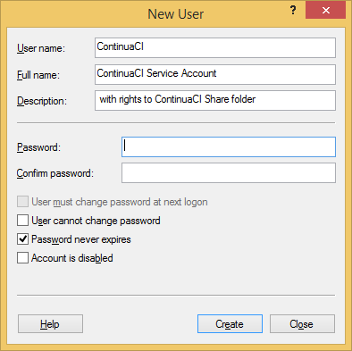

#Stage-B-Continua-CI-Prerequisites-Service-Account.md

Both Continua CI Server and Continua CI Agent require a service account to run on.

Better choose a strong password there, as it will be used to perform all builds.

Make a good note of the domain, username and password as you need it in both the Server and Agent installations.

Later on, this user also needs to get the correct permissions to the Continua CI Share and Folder.

##Step B00: add Continua CI Service Account user with rights to Continua CI Share and Folder

