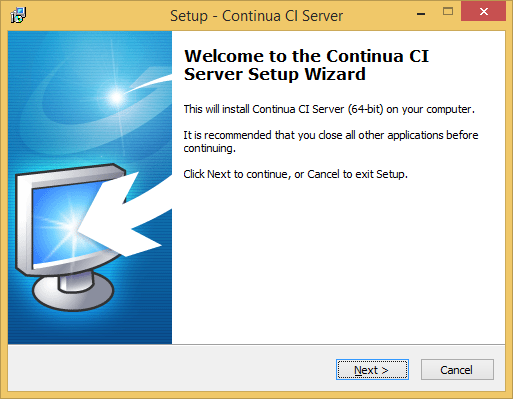
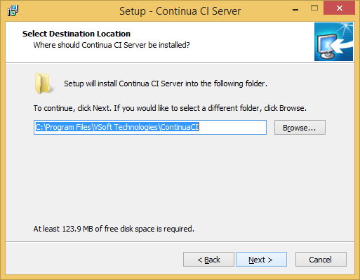
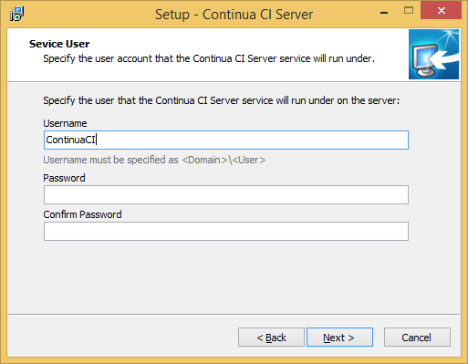
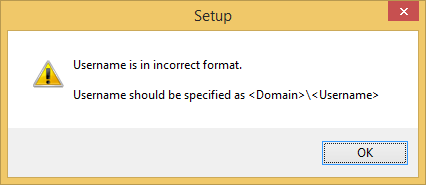
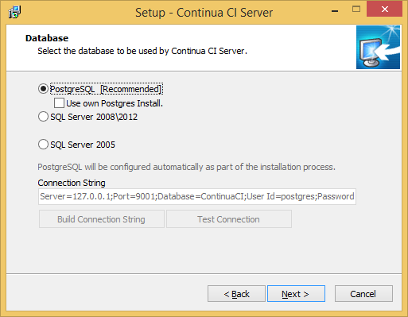
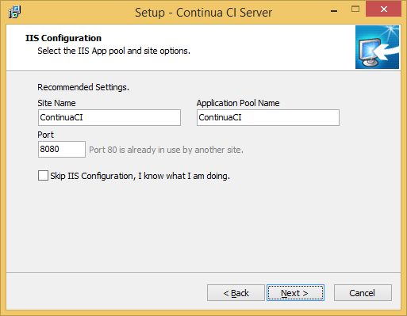
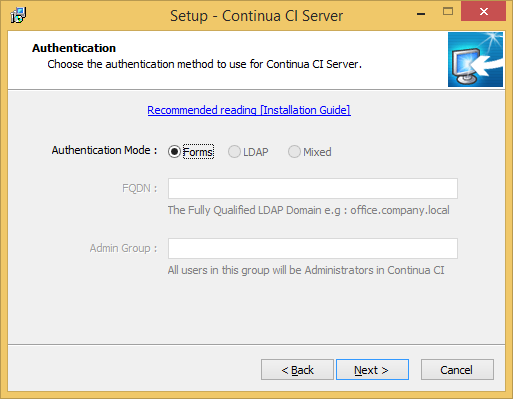
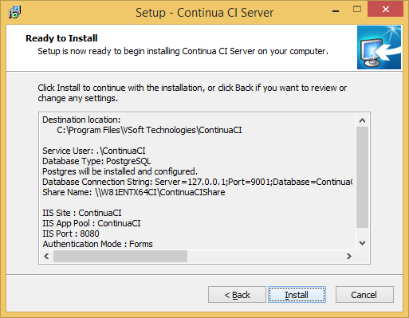
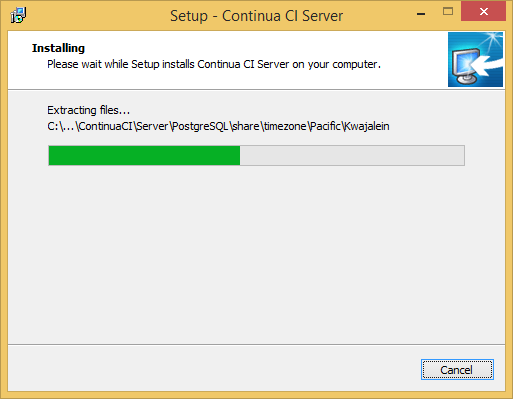

# Stage C: Installing the Continua CI Server

## Step C00: Welcome to the Continua CI Server Setup Wizard

Here you just press the next button

## Step C01: select directory for the Continua CI Server

## Step C02: specify the service user under which Continua CI Server runs

## Step C03: the user requires a domain or computer name

## Step C04: use dot as shortcut for `current computer`

## Step C05: specify the share name and shared directory

A directory starting in the root of a drive is not recommended (though default) as that makes it harder to inherit folder rights.

Share name `ContinuaCIShare` (needed later when installing the Agent)
Share directory `C:\ContinuaCI\Share` (don't make the path too long as the version control system have trouble with long path names: somehow they all suffer from [`MAX_PATH`](http://msdn.microsoft.com/en-us/library/aa365247) issues).

## Step C06: keep the default database architecture PostgreSQL

## Step C07: Keep the default values for Site name, Pool name and Port

## Step C08: specify IIS authentication

Specify the IIS authentication here. For publicly accessible servers, keep it at `Forms` authentication.

**(Note that clicking on the hyperlink will do nothing: it fails)**

## Step C09-ready-to-install.png

This is your last chance to verify all the settings you entered are correct.

## Step C10: installing

Installation takes a while. On SSD equiped hardware usually less than a minute.

## Step C11: Install Finished

When the Continua CI Server installation is finished, you can (and for the free installation: should) run the embedded Continua CI Agent installer.
