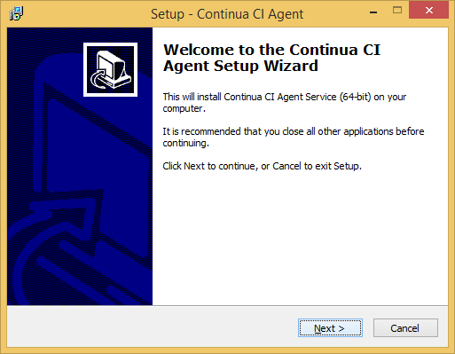
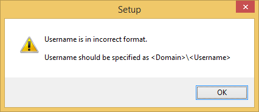
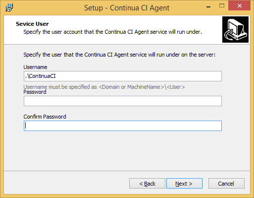
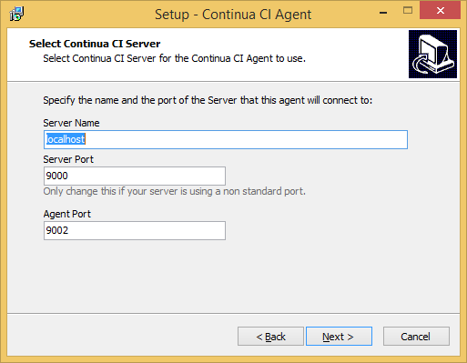
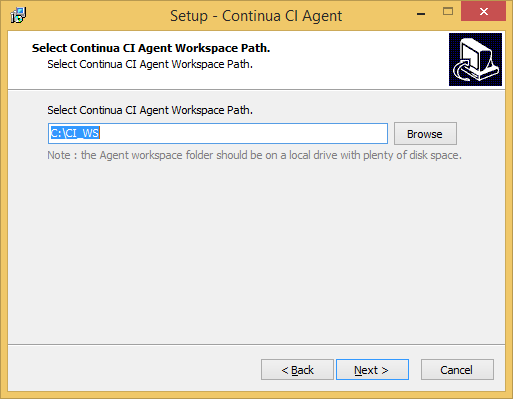
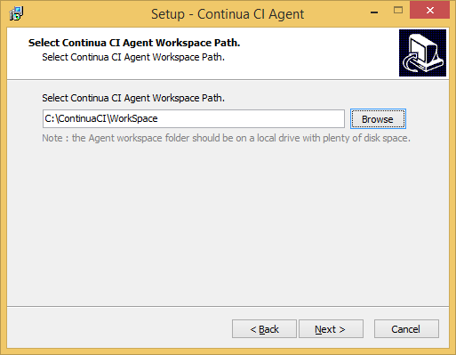
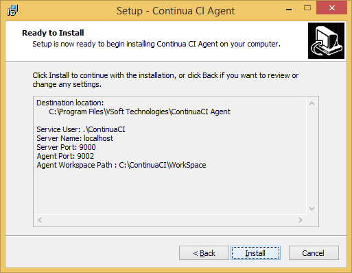
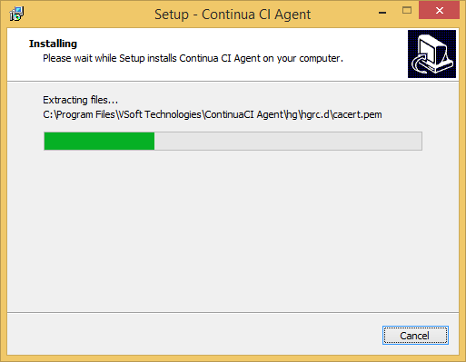
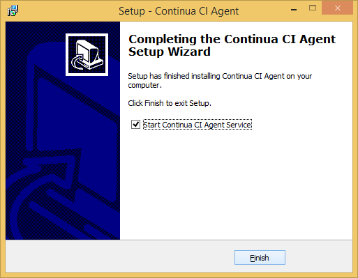

# Stage D: Installing the Continua CI Agent

## Step D00: Start CI Agent Setup

## Step D01: specify the service user under which Continua CI Agent runs

## Step D02: the user requires a domain or computer name

## Step D03: use dot as shortcut for `current computer`

## Step D04: specify host and ports

For free installations, the Agent runs on the same computer as the Server, so the Server Name is `localhost`.

## Step D05: specify ContinuaCI Agent Workspace Path

Update this from the default `C:/CI_WS` to `C:\ContinuaCI\WorkSpace` on the next step.

## Step D06: specify ContinuaCI Agent Workspace Path subdirectory

## Step D07: ready to install

This is your last chance to verify all the settings you entered are correct.

## Step D08: installing

Installation takes a short while. On SSD equiped hardware usually less than half a minute.

## Step D09: finished start agent

