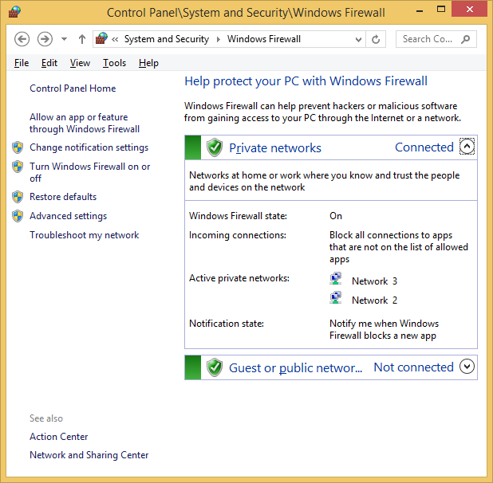
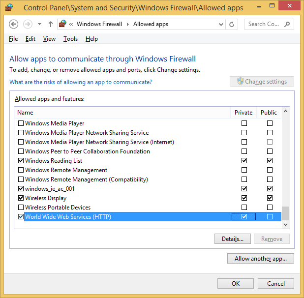
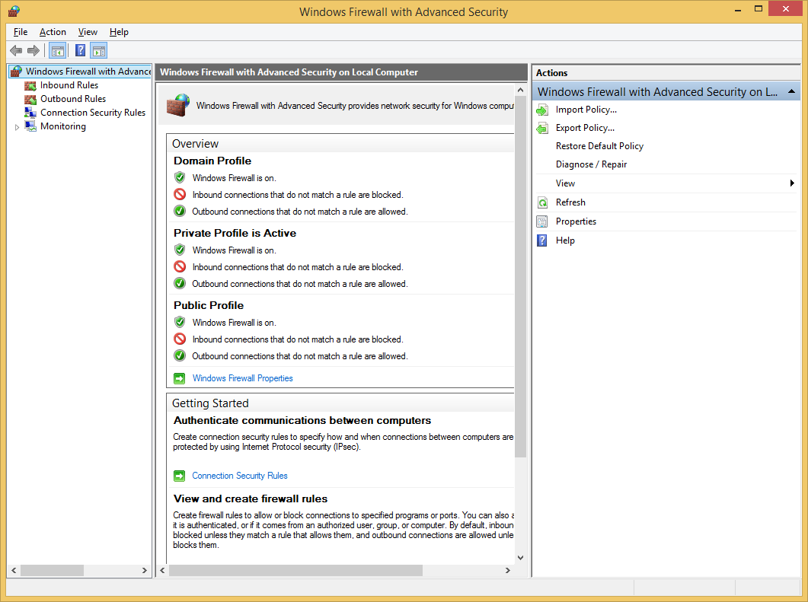
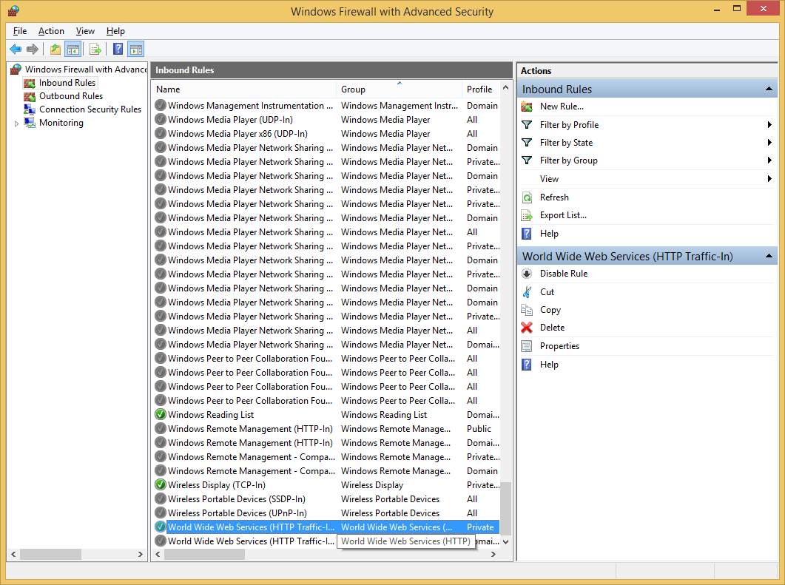
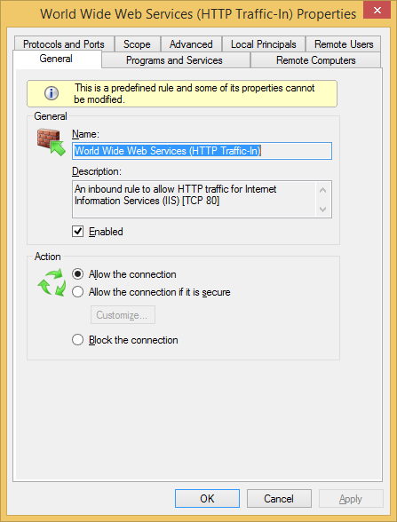
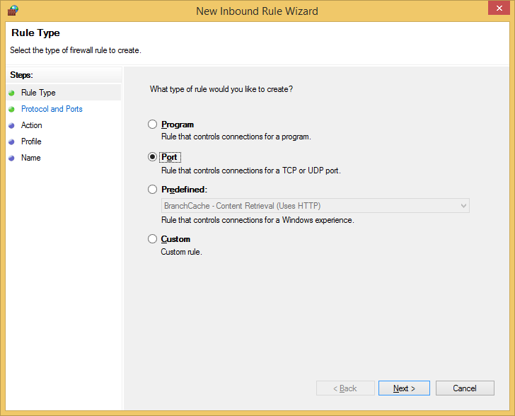
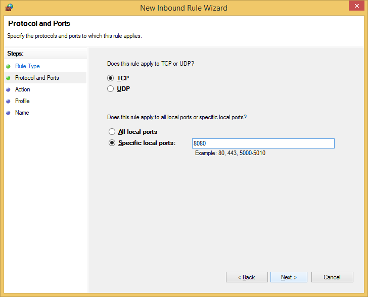
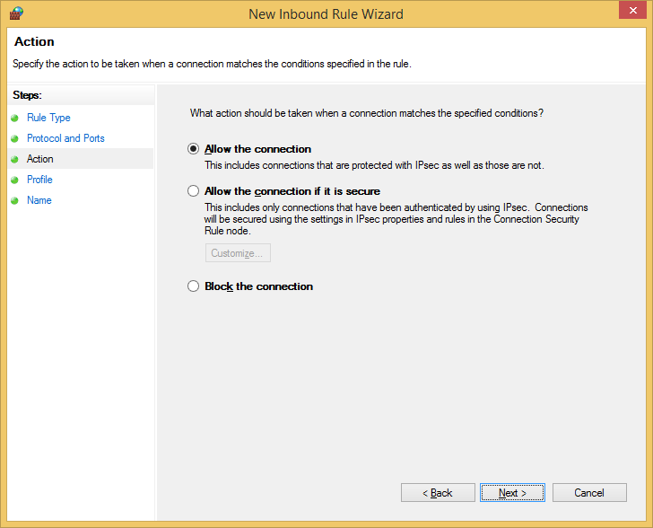

# Stage G: Enable Remote Access to Continua CI Web Server Through Windows Firewall

By default the Windows Firewall neither allows http port 80 nor port 8080 to be accessible from the outside world.

These steps show you how to do that for both port 80 (the default http port for IIS) and port 8080 (the default port for the Continua CI web server configuration).

Alternatively, you can have Continua CI be served as a sub-part of the default http port. 

## Step G00: Windows firewall

## Step G01: enable WWW services in firewall

## Step G02: enable WWW services in firewall

## Step G03: Windows firewall with advanced security

## Step G04: Windows firewall with advanced security WWW

## Step G05: Windows firewall with advanced security WWW details

## Step G06: Windows firewall with advanced security New inbound rule

## Step G07: Windows firewall with advanced security New inbound rule port 8080

## Step G08: Windows firewall with advanced security New inbound rule port allow connection

## Step G09: Windows firewall with advanced security New inbound rule port only private networks

## Step G10: Windows firewall with advanced security New inbound rule port name 8080

