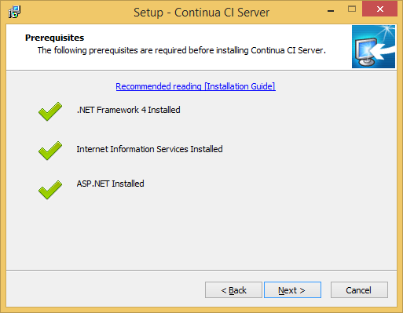
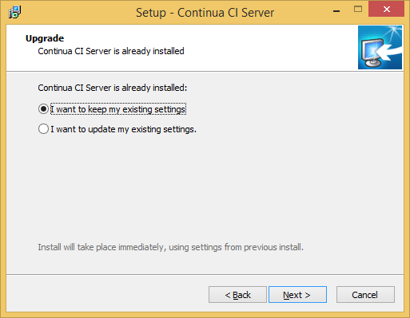
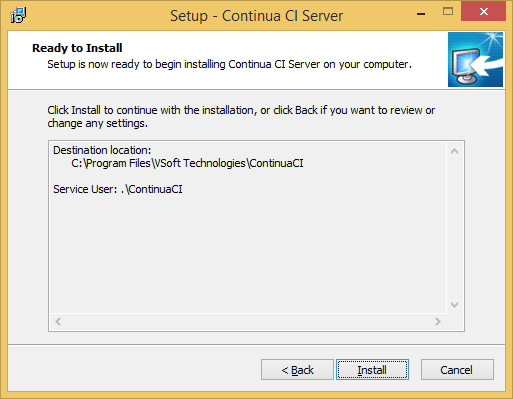
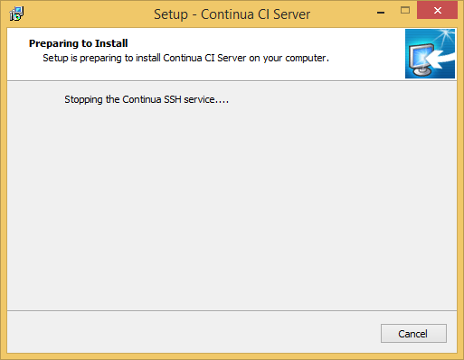
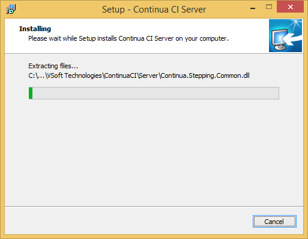
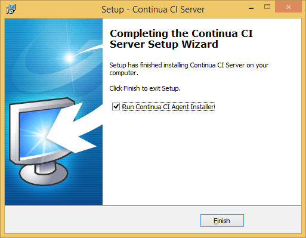

# Stage H: Upgrading Continua CI Server to New Version

These steps show how to upgrade Continua CI Server 1.0 to 1.5, but the steps are identical for any 1.0.x.y or 1.5.x.y upgrade.

Normally this is just a `Next`, `Next`, `Next`... setup followed by the same for Continua CI Agent.

## Step H00: Upgrade Continua CI Server - welcome

## Step H01: Upgrade Continua CI Server - prerequisites OK

## Step H02: Upgrade Continua CI Server - keep existing settings

## Step H03: Upgrade Continua CI Server - ready to install

## Step H04: Upgrade Continua CI Server - preparing install

## Step H05: Upgrade Continua CI Server - installing

## Step H06: Upgrade Continua CI Server - finished - continue with agent

