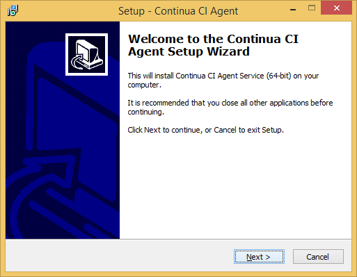
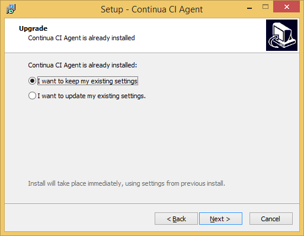
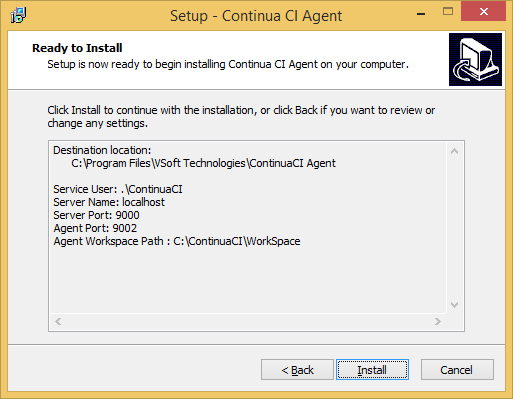
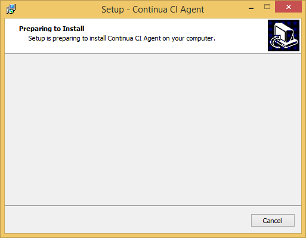
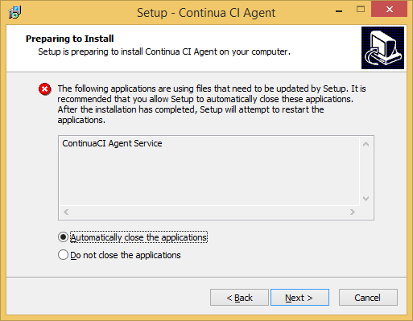
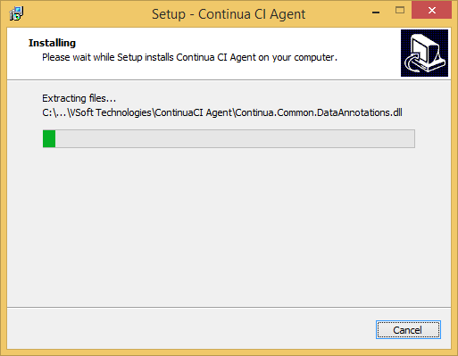
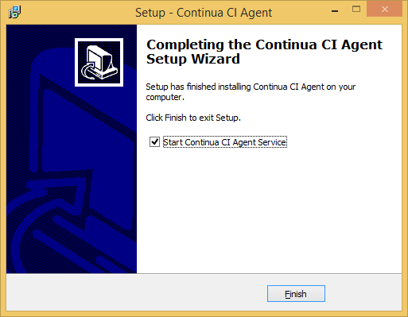

# Stage I: Upgrading Continua CI Agent to New Version

These steps show how to upgrade Continua CI Agent 1.0 to 1.5, but the steps are identical for any 1.0.x.y or 1.5.x.y upgrade.

Normally this is just a `Next`, `Next`, `Next`... setup followed like the upgrade of Continua CI Server.

## Step I00: Upgrade Continua CI Agent - welcome

## Step I01: Upgrade Continua CI Agent - keep existing settings

## Step I02: Upgrade Continua CI Agent - ready to install

## Step I03: Upgrade Continua CI Agent - preparing

## Step I04: Upgrade Continua CI Agent - prepping agent is running

## Step I05: Upgrade Continua CI Agent - installing

## Step I06: Upgrade Continua CI Agent - finished

