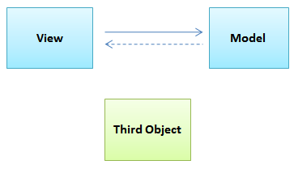
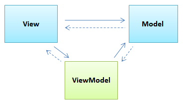
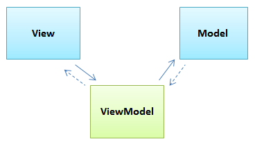
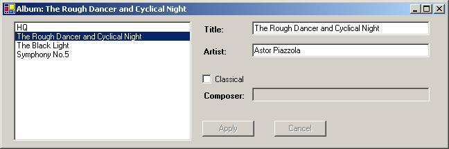
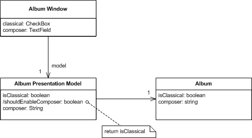
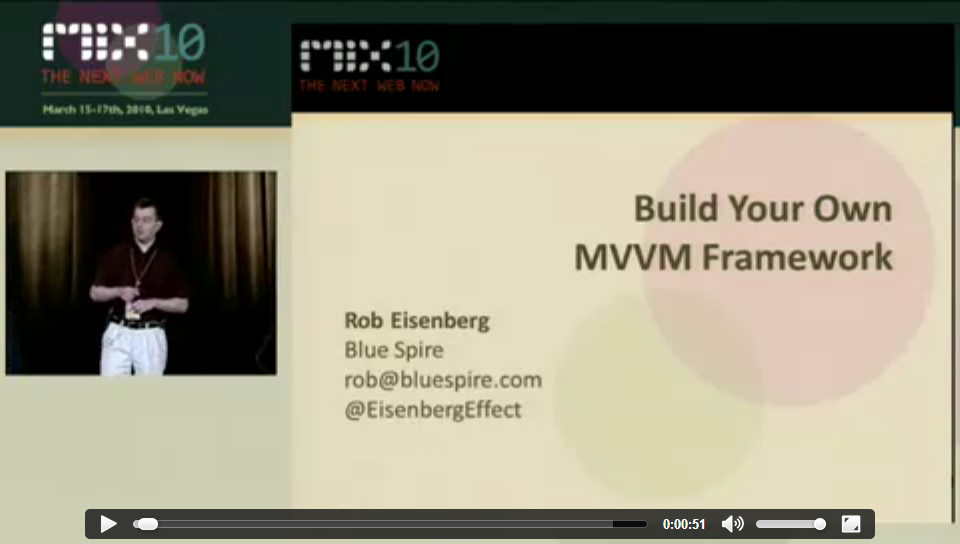

# MVVM in Delphi using the Caliburn Micro for Delphi framework.

## MVVM: A bit of background on *Model, View and View Model*

MVVM is one of the ways to help split parts of your application into three layers. Doing so makes it easier to "organize the mess", allows you to unit test not only the business logic but also the interaction logic in an early stage, and makes it easier to switch user interfaces when aiming for cross-platform versions of your applications.

The really cool thing is that you can apply do not have to start with MVVM from scratch. You can apply the ideas from MVVM into existing applications as well and evolve them into a fully fledged MVVM application. It means MVVM gives you a lot of freedom on which I will write more at a later stage. Let's first focus on the introduction though.

> My encounter with MVVM was in the .NET and later in the Delphi world with a self written framework similar to what [Malcolm Grooves presented at CodeRage 7](http://www.malcolmgroves.com/blog/?p=1328). Back then I wasn't too impressed with what I achieved. Even though I was used to naming conventions, most of the things were still manual labour. Too much tedious manual labour.
>
> Later I bumped into Caliburn for .NET, but at that time I was working with applications that hadn't been maintained since around 2005 in a way that was hard to move to MVVM. Last year, I was really glad to see DSharp was having an MVVM presentation model, and even more happy that is was being revamped into something very much alike Caliburn Micro, which was the successor of Caliburn. Pieces of the puzzle started falling into place when I recognized how easy you could integrate it with existing applications.

Before explaining more about MVVM, let's take a step back and look at the `3rd object`.

### The 3rd object

*(3rd object images thanks to [Paul Stovell's 3rd object article](http://paulstovell.com/blog/third-object))*

All to often, applications - Delphi or otherwise - are "structured" like these:  

or, if you are lucky, like:

Adding a 3rd object makes sense to make things less monolithic and more maintainable:

It all comes down to [Separation of Concerns](http://en.wikipedia.org/wiki/Separation_of_concerns):

- Cutting business logic away from your UI
- Swapping your UI (VCL, FireMonkey, Mobile, Web, …)
- Making it easier to test user interaction without a View layer

By pushing tests from a View to automated tests, you move them from the time consuming and labour intensive acceptance test or end-to-end test phases into the automated unit test phase. This way it becomes much easier and cheaper to test the user interaction logic from the View Model.

*([Picture](AcceptanceVsIntegrationTests.png) thanks to [Jonas Bandi](http://blog.jonasbandi.net/2010/09/acceptance-vs-integration-tests.html)*)

### Binding the 3rd object

The question is: how do you bind View, Model and the 3rd object?

That highly depends on what kind (or even flauvour) of 3rd object architecture you use: MVC, MVP, MVVM, et cetera. A few of them are here:

Caliburn sticks to the last one: the View binds to the View Model, and the View Model to the Model. Updates come from the Model to the View Model and from the View Model to the View. There is no binding between the View and Model at all.

This setup allows you to change any of the 3 layers and be very flexible.

> The traditional 3rd layer in Delphi is to separate user interface into forms, business logic into data modules and your data into some form of storage. This has worked for 15 years, but still needs a lot of plumbing and it is hard to change the UI as the binding is usually tied to the VCL platform.

#### MVVM: the View Model

When starting with MVVM, the term View Model wasn't making much sense to me at first. I was missing the steering layer from the controller or presenter in MVC and MVP. And I'm not the only one, as you can see from this MVVM Wikipedia [excerpt](http://en.wikipedia.org/wiki/Model_View_ViewModel#cite_ref-10):

> The term "View model" is a major cause of confusion in understanding the pattern when compared to the more widely implemented MVC or MVP patterns. The role of the controller or presenter of the other patterns has been substituted with the framework binder (e.g., XAML) and view model as mediator and/or converter of the model to the binder.

In MVVM the steering role is taken over by the framework, and the View Model focuses a lot more on (testable!) logic than the controller in MVC or the presenter in MVP.

MVVM favours these concepts:

- Decoupling
- Composition over inheritance
- Test driven development
- Patterns, conventions, ...

### MVVM origins: XP, Agile and the Presentation Model

The origins from MVVM go far back to the [Agile software mantra](http://en.wikipedia.org/wiki/Agile_software_development) that nowadays everybody advocates but actually evolved in 2001 with the [Agile Manifesto](http://agilemanifesto.org/) that was [based on the eXtreme Programming](http://blog.8thlight.com/uncle-bob/2013/12/10/Thankyou-Kent.html) (aka XP) from the mid 90s of last century.

Back in 2004, Martin Fowler published his famous [Presentation Model](http://martinfowler.com/eaaDev/PresentationModel.html ) article presenting a simple UI:

with these class and sequence diagrams:

 

This is very much like the MVVM, with the exception that in MVVM the framework will take care of all the binding.

(Martin Fowler kindly gave permission to use his above pictures and the below book cover and portrait).

### Refactoring

Back in 1999 - in the middle of the XP era - Martin Fowler wrote a great book titled [Refactoring: *Improving the Design of Existing Code*](http://martinfowler.com/books/refactoring.html). It influenced the way we write software until today even in Delphi. It is so current that in 2012 it appeared in a special Kindle edition.

The book has a [catalog of simple recipes](http://refactoring.com/catalog) that describe how to improve certain bad coding patterns in to better code. Patterns like `Extract Method` or `Encapsulate Field` are essential to how we develop code and give us a set of conventions on how to do just that.

MVVM is all about patterns and conventions, so let's look at another important book, but now at the start of the Agile era.

 

### Patterns

In 2004, the - instantly famous - Gang of Four (abbreviated to GoF) published the book [Design Patterns: *Elements of Reusable Object-Oriented Software*](http://en.wikipedia.org/wiki/Design_Patterns)

The book is another catalog, this time on patterns, with a common vocabulary about recipes for developing new code.

The [Gang of Four](http://c2.com/cgi/wiki?GangOfFour) consists of Erich Gamma, Richard Helm, Ralph Johnson and John Vlissides.

[Martin Fowler on the GoF book](http://martinfowler.com/bliki/GangOfFour.html‎) in relation to the 3rd object:

> In my view the Gang of Four is the best book ever written on object-oriented design - possibly of any style of design. This book has been enormously influential
The 3rd object is “just” a (relatively) new way of using patterns.

## Why this MVVM article?

MVVM combines refactoring, patterns, conventions and much more into a way of developing software that is maintainable and testable in a way that makes the best use of modern language features without the need of the developer to master each and all of those features in great detail.

There are two reasons I started advocating using MVVM with Delphi. The primary one is that there are exciting times ahead for Delphi developers. With added functionality like generics, attributes and a truckload of RTTI, new (and hopefully old!) platforms, lots of new possibilities - including MVVM - are already there, or on the horizon.

Another reason is that these open source projects can use your help. Simple help like just using it and giving feedback can tremendously move them forward.

So here is my favourite shortlist of projects you could contribute to:

- [Spring4D](http://Spring4D.org)
- [DSharp](http://DSharp.org) (including the [Caliburn feature branch](https://bitbucket.org/sglienke/dsharp/branch/feature/Caliburn) on which this article is based)
- [DUnit](http://en.wikipedia.org/wiki/DUnit)
- [DUnitX](https://github.com/VSoftTechnologies/DUnitX) and [DelphiMocks](https://github.com/VSoftTechnologies/Delphi-Mocks)
- [DelphiSpec](https://github.com/RomanYankovsky/DelphiSpec)
- The [Delphi JEDI](https://github.com/project-jedi) projects (including [JCL](https://github.com/project-jedi/jcl) and [JVCL](https://github.com/project-jedi/jvcl))
- [GExperts](http://www.gexperts.org)

Note that the vast majority of those projects use a [DVCS](http://en.wikipedia.org/wiki/Distributed_version_control_system) for version control like [Git](http://en.wikipedia.org/wiki/Git_(software)) or [Mercurial](http://en.wikipedia.org/wiki/Mercurial_(software)), so that is another learning opportunity for many Delphi developers.

## Caliburn Micro for .NET was our origin

Back in 2010, Rob Eisenberg gave a very influential speech titled [Build Your Own MVVM Framework](http://devlicio.us/blogs/rob_eisenberg/archive/2010/03/16/build-your-own-mvvm-framework-is-online.aspx), which led to wide adoption of Caliburn Micro in the .NET world. The Delphi implementation is mimicked after it, and now even a JavaScript library is.

His speech has since then been [published on Channel 9](http://channel9.msdn.com/Events/MIX/MIX10/EX15) and well worth viewing as lots of the Delphi implementation works in a similar way.

## Caliburn Micro for Delphi is part of `DSharp`

Currently, Caliburn Micro for Delphi is in alpha stage. It is hosted at the [DSharp repository](http://bitbucket.org/sglienke/dsharp) from [Stefan Glienke](https://www.google.com/+StefanGlienke).

Stefan has done most of the core `DSharp` work and a lot of `Spring4D` work (both DSharp and Caliburn depend on `Spring4D`).

Most of the Caliburn specific work has been done by [Marko Vončina](http://si.linkedin.com/pub/marko-von%C4%8Dina/85/741/895).

Internally, all these frameworks heavily depend on these Delphi features:

- interfaces
- attributes
- generics
- RTTI

They expose many classes and interfaces (attributes are based on classes). Applications based on Caliburn will use interfaces and attributes a lot.

> Make sure you read the [Coding in Delphi](http://leanpub.com/codingindelphi) book by [Nick Hodges](http://www.nickhodges.com) if you feel unfamiliar with them. Actually: just read the book anyway. I learned a lot while reading it!
