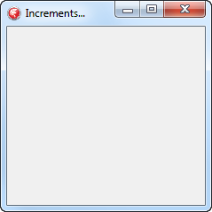
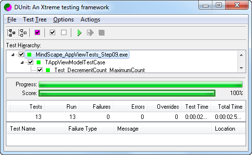
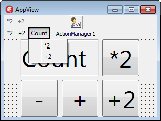
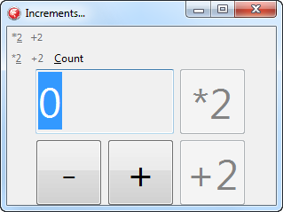
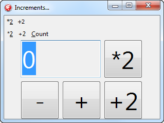
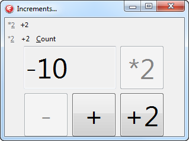
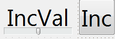

# Steps in `MindScape_AppView_StepByStep.groupproj`

The goal is to write an application using MVVM that:

- is based on patterns and conventions by using RTTI
- is driven by the *View Model* (not the *View* so you can change the View later on)
- have the user interaction logic in the *Model View*
- can have the *View Model* be unit tested in an early stage
- have the data storage in a *Model*
- can have the *Model* be unit tested in an early stage as well
- runs in Delphi XE or higher
- builds warning and hint free

> During the steps you will see some failures that are in subsequent steps. That is deliberate: it is nice having working demos but in practice you are going to bump into things (any developer does, I do too), so it is good to see the things you might bump into upfront and how easy it is to solve them.

The projects are based on the [Mindscape HQ MVVM demos](http://www.mindscapehq.com/blog/index.php/2012/01/12/caliburn-micro-part-1-getting-started) that use the [Caliburn Micro for .NET framework](http://www.caliburnproject.org). Though Delphi is different than .NET, the ideas in the framework are kept the same as much as possible. The demos will teach you where things differ most.

So the Delphi application will eventually look similar to this Caliburn Micro for .NET based WPF application: it can add, double and increment, all from a View Model automagically updating the View. In fact the Delphi application will also add a Model that is persistent in an INI file!

A common thing is that Caliburn Micro for Delphi depends heavily on RTTI ([Run Time Type Information](http://docwiki.embarcadero.com/RADStudio/en/Run-Time_Type_Information_(Delphi))) to make the conventions and patterns work for you.

> In the steps, I will put () parenthesis to parameterless methods to set them apart from properties or fields. Most of the times that is optional, but at times it is required, and for me it makes it easier to see what the code is aimed at: method calls often have side effects, but most of the time accessing fields and properties should not.

> Some of the steps might sound overly detailed, and the total might scare you at first. The scaring is not on purpose, but the fine grained steps are: for me it is important to show you want is in involved, and what you might bump into. In practice these steps will take only a short amount of time.

For the project names, you can optionally include a `_Step##` prefix where `##` has the step number. I've done that in the examples below as that makes it easier for you to find back the individual steps in the [DSharp code repository](https://bitbucket.org/sglienke/dsharp).

Let's get on with the steps...

## Step 00: an empty VCL and DUnit application

Create a new project group that contains an empty [VCL](http://en.wikipedia.org/wiki/Visual_Component_Library) project with one empty form, and a [DUnit](http://dunit.sourceforge.net) test project that has no tests yet.

### `VCL` project

Name the form `AppView`, the form unit `AppViewForm` and clean up the `uses` list, `private` and `public` sections:

    unit AppViewForm;

    interface

    uses
      Forms;

    type
      TAppView = class(TForm)
      end;

    var
      AppView: TAppView;

    implementation

    {$R *.dfm}

    end.

Name the application `MindScape_AppViewVCL`:

    program MindScape_AppViewVCL_Step00;

    uses
      Forms,
      AppViewForm in 'AppViewForm.pas' {AppView};

    {$R *.res}

    begin
      ReportMemoryLeaksOnShutdown := True;
      Application.Initialize();
      Application.MainFormOnTaskbar := True;
      Application.CreateForm(TAppView, AppView);
      Application.Run();
    end.

### `DUnit` testing project

This is based on the standard DUnit project template with a twist: it reports memory leaks, and a bit more cleaned up code when switching between console and GUI applications.

    program MindScape_AppViewTests_Step00;

    {$IFDEF CONSOLE_TESTRUNNER}
    {$APPTYPE CONSOLE}
    {$ENDIF}

    uses
      Forms,
      TestFramework,
      GUITestRunner,
      TextTestRunner;

    {$R *.res}

    begin
      ReportMemoryLeaksOnShutdown := True;
      if IsConsole then
        with TextTestRunner.RunRegisteredTests do
          Free()
      else
      begin
        Application.Initialize();
        GUITestRunner.RunRegisteredTests();
      end;
    end.

## Step 01: adding the interfaces and View Model

Add two units to the projects: `AppInterfaces` with the interface definitions and `AppViewModel` that contains the View Model. Later we will add another unit with a Model as well.

After that make the modifications to the units and project file as shown in these sections.

### The `AppInterfaces` unit

For now, there will be one interface in it that defines the Model View. Note that you need a GUID for this interface, as that will enable the compiler to generate RTTI.

    unit AppInterfaces;

    interface

    type
      IAppViewModel = interface
        ['{38C5B8ED-8269-463D-847D-09F6A7B99584}']
      end;

    implementation

    end.

### The `AppViewModel` unit

The `AppViewModel` unit contains the View Model for our application. It will drive the View. For now the View Model will be empty: it's just the scaffolding for the rest of the steps.

Since the `TAppViewModel` depends on the `IAppViewModel` interface, the `AppViewModel` unit uses the `AppInterfaces` unit.

`TAppViewModel` descends from `TScreen` which is a base class that can be bound to a container that can be visible (usually a `TForm` or `TFrame`).

The final step is in the `initialization` section of the unit: it refers to the [ClassName](http://docwiki.embarcadero.com/Libraries/en/System.TObject.ClassName) of the `TAppViewModel`. This effectively instructs the compiler and linker to include the class and the RTTI in the executable. This allows Caliburn to use the RTTI and bind the View Model and View together.

    unit AppViewModel;

    interface

    uses
      AppInterfaces,
      DSharp.PresentationModel;

    type
      TAppViewModel = class(TScreen, IAppViewModel)
      end;

    implementation

    initialization
      TAppViewModel.ClassName;
    end.

### No modifications for the form

The really cool thing is that the form does not require any modification. It does not need to implement the `IAppViewModel` interface (that is done by the `TAppViewModel` class).

The Caliburn framework will take care of binding the View Model and View for you.

### The modifications to the VCL project file.

The project file also needs a few modifications:

Insert these at the top of the `uses` list:

      {$IFDEF CodeSite}
      DSharp.Logging.CodeSite,
      {$ENDIF CodeSite}
      DSharp.PresentationModel.VCLApplication,

This enables the [CodeSite logging tool](http://www.raize.com/DevTools/CodeSite) that is included with most recent Delphi versions.

> DSharp has support of other logging destinations like [SmartInspect](http://www.gurock.com/smartinspect/), Console,  or OutputDebugString as well.

It will also extend the `TApplication` using class helpers so the Caliburn framework can initialize the repository of View Models and Views, and then start the application.

Finally replace

      Application.CreateForm(TAppView, AppView);
      Application.Run();

with

    {$IFDEF DEBUG}
      Application.WithDebugLogger();
    {$ENDIF DEBUG}
    {$IFDEF CodeSite}
      Application.WithLogger<TCodeSiteLog>();
    {$ENDIF CodeSite}
      Application.Start<TAppViewModel>();

The first lines will initialize the logging.

The last line will use the `TAppViewModel` to start the application with. Later we will switch to the `IAppViewModel` for that.

This is the main program you are after:

    program MindScape_AppViewVCL_Step01;

    uses
      {$IFDEF CodeSite}
      DSharp.Logging.CodeSite,
      {$ENDIF CodeSite}
      DSharp.PresentationModel.VCLApplication,
      Forms,
      AppInterfaces in 'AppInterfaces.pas',
      AppViewForm in 'AppViewForm.pas' {AppView},
      AppViewModel in 'AppViewModel.pas';

    {$R *.res}

    begin
      ReportMemoryLeaksOnShutdown := True;
      Application.Initialize();
      Application.MainFormOnTaskbar := True;
    {$IFDEF DEBUG}
      Application.WithDebugLogger();
    {$ENDIF DEBUG}
    {$IFDEF CodeSite}
      Application.WithLogger<TCodeSiteLog>();
    {$ENDIF CodeSite}
      Application.Start<TAppViewModel>();
    end.

### Add unit `AppViewModelTestCase` to the test project

Like the View and View Model, the initial `TAppViewModelTestCase` is also empty. The next steps will add tests each time functionality is added to the View Model.

For the test case to compile, also add the `AppViewModel` unit to the DUnit test project.

    unit AppViewModelTestCase;

    interface

    uses
      TestFramework,
      AppInterfaces,
      AppViewModel;

    type
      TAppViewModelTestCase = class(TTestCase)
      strict private
        FAppViewModel: IAppViewModel;
      strict protected
        property AppViewModel: IAppViewModel read FAppViewModel;
      public
        procedure SetUp; override;
        procedure TearDown; override;
      end;

    implementation

    procedure TAppViewModelTestCase.SetUp;
    begin
      FAppViewModel := TAppViewModel.Create();
    end;

    procedure TAppViewModelTestCase.TearDown;
    begin
      FAppViewModel := nil;
    end;

    initialization
      RegisterTest(TAppViewModelTestCase.Suite);
    end.

## Step 02: making Caliburn recognize your form as a valid View

When you try running the unit test from Step 01, it works. But the VCL app shows a tiny form with caption `ChildForm` and content `View not found for TAppViewModel`. So let's start to explain why you get the `View not found for TAppViewModel` error in the first place.

Caliburn needs to be able to find which View belongs to a View Model. In our case, it needs to find a View for the `TAppViewModel`. We know it is `TAppView` (it is one of the Caliburn conventions), but Caliburn doesn't know about `TAppView` as it needs the RTTI for it.

So, like we did with `TAppViewModel`, we need to make sure that the RTTI for `TAppView` is registered as well.

So we need to do the `TAppView.ClassName` trick.

But that is not all: we also need to make sure that Caliburn can add some extra functionality.

For that, add the unit `DSharp.Bindings.VCLControls` to the uses list. It contains (among a lot of other things) a new `TForm` implementation that descends from `Forms.TForm` (this is called an [interceptor class](https://www.google.com/#q=%22interceptor+class%22+Delphi), something presented for instance [by Delphi.about.com in 2009](http://delphi.about.com/od/delphitips2009/qt/interceptor.htm)).

The `TForm` interceptor adds extra behaviour to `Forms.TForm` like notifications.

In fact `DSharp.Bindings.VCLControls` contains interceptor classes for these Delphi units:

- `ComCtrls`
- `CommCtrl`
- `Controls`
- `ExtCtrls`
- `Forms`
- `Grids`
- `StdCtrls`

So the `AppViewForm` unit now becomes this:

    unit AppViewForm;

    interface

    uses
      DSharp.Bindings.VCLControls;

    type
      TAppView = class(TForm)
      end;

    implementation

    {$R *.dfm}

    initialization
      TAppView.ClassName;
    end.

## Step 03: drive the application using the View Model interface

The app now is already View Model driven by the `TAppViewModel` class.

Wouldn't it be cool if it were driven by the `IAppViewModel` interface?

You'd think it is as simple as modifying the project and replace

      Application.Start<TAppViewModel>();

with

      Application.Start<IAppViewModel>();

It almost is, and indeed it is the first step. And you get another error that too is part of the learning experience:

    Exception EResolveException 'No component was registered for the service type: IAppViewModel.'.

(Sometimes you will get a series of other exceptions, we will investigate that see where it needs fixing).

The cause of this exception is that Caliburn tried to find the class implementing `IAppViewModel` but couldn't get to `TAppViewModel`.

RTTI is not the only part in the foundation of Caliburn: there is also a composition framework inside DSharp that - not surprisingly - is mimicked after a .NET framework as well. You need to decorate the `IAppViewModel` with the `InheritedExport` or `InheritedExportAttribute` attribute which works virtually identical to the [InheritedExportAttribute in .NET](http://msdn.microsoft.com/en-us/library/system.componentmodel.composition.inheritedexportattribute).

When booting your application, Caliburn composes a graph of dependent objects (Models, View Models, Views) that build your application.

The `InheritedExport` attribute is in the `DSharp.PresentationModel` unit so that's why your `IAppViewModel` declaration should look like this:

    unit AppInterfaces;

    interface

    uses
      DSharp.PresentationModel;

    type
      [InheritedExport]
      IAppViewModel = interface
        ['{38C5B8ED-8269-463D-847D-09F6A7B99584}']
      end;

    implementation

    end.

If you now run the application, it looks nice again:

Wow, an empty form in just 3 steps (:

The cool things:

- it is View Model driven (the next steps will show more of that)
- Caliburn automagically did the binding (hence the Caption is now `TAppViewModel`, not `AppView`)
- no global variables, `Application.FormCreate` and stuff like that any more: everything is dynamic

So let's move on!

## Step 04: have the View Model drive the View's Caption

### Add an `Increments...` caption

Let's have the View Model steer a better `Caption` on the View, like `Increments...`:

It's a simple two-step process

add a `resourcestring` to the `AppInterfaces` unit:

    resourcestring
      IAppViewModel_DisplayName = 'Increments...';

then add a `public` constructor to the `TAppViewModel` like this:

    unit AppViewModel;

    interface

    uses
      AppInterfaces,
      DSharp.PresentationModel;

    type
      TAppViewModel = class(TScreen, IAppViewModel)
      public
        constructor Create(); override;
      end;

    implementation

    constructor TAppViewModel.Create();
    begin
      inherited Create();
      DisplayName := IAppViewModel_DisplayName;
    end;

    initialization
      TAppViewModel.ClassName;
    end.

Caliburn will automagically call this constructor when composing the object graph.

Try it and enjoy how easy this step was, and how little design-time effort it took.

### test for the `Increments...` caption

Add a `published` method `Test_DisplayName` to the test case:

  published
    procedure Test_DisplayName();

then add the `DSharp.PresentationModel` unit to the DUnit test project and implementation uses clause:

    uses
      DSharp.PresentationModel;

and implement the `Test_DisplayName` method.

    procedure TAppViewModelTestCase.Test_DisplayName();
    var
      LHaveDisplayName: IHaveDisplayName;
    begin
      LHaveDisplayName := AppViewModel as IHaveDisplayName;
      CheckEquals(IAppViewModel_DisplayName, LHaveDisplayName.DisplayName);
    end;

The [IHaveDisplayName](http://www.nudoq.org/#!/Packages/Caliburn.Micro/Caliburn.Micro/IHaveDisplayName) interface is one of the many interfaces in Caliburn. This one exposes the `DisplayName` property. `TScreen` implements that interface so it indicates it supports having and supporting the `DisplayName` property.

Now run and see if the first unit test on the View Model succeeds. Do you get the same result as below?

## Step 05: adding a Count property to the View Model and control to the View

One of the Caliburn conventions is that if you have a control in the View with the same name as a property in the View Model, that they will automagically be bound together.

So let's start with adding a `TEdit` control called `Count` on the View, and notice that Delphi automagically extends the uses list for you:

    uses
      DSharp.Bindings.VCLControls,
      Classes,
      Controls,
      StdCtrls;

    type
      TAppView = class(TForm)
        Count: TEdit;
      end;

Now add the Count property to the View Model:

      TAppViewModel = class(TScreen, IAppViewModel)
      strict private
        FCount: Integer;
      strict protected
        function GetCount(): Integer; virtual;
        procedure SetCount(const Value: Integer); virtual;
      public
        constructor Create(); override;
        property Count: Integer read GetCount write SetCount;
      end;

and have it backed by a get and set methods:

    function TAppViewModel.GetCount(): Integer;
    begin
      Result := FCount;
    end;

    procedure TAppViewModel.SetCount(const Value: Integer);
    begin
      if Count <> Value then
      begin
        FCount := Value;
        NotifyOfPropertyChange('Count');
      end;
    end;

The `DSharp.Bindings.VCLControls` has class interceptors adding notification to most controls that ship with Delphi, the View Model must also notifications. The above `SetCount` implementation shows this for properties; we will see later that this also can hold for methods.

Now let's run the application and see if design-time gets bound on run-time:

 

You see that it doesn't, and that's what the next step will fix.

## Step 06: fixing the binding.

The previous step told about the importance of the interceptor classes in the `DSharp.Bindings.VCLControls` unit.

And that is exactly the reason why at run-time you got `Count` into the caption of the `TEdit`: it wasn't bound to the integer value of `Count` in the View Model, as the interceptor classes could not do their work. The reason is that Delphi does not see them as they are obscured by the units that expose the actual control.

> The lesson is easy: always make sure that units like `DSharp.Bindings.VCLControls` that have interceptor classes are at the very end of the uses list.

So the solution is very simple, modify the uses list from

    uses
      DSharp.Bindings.VCLControls,
      Classes,
      Controls,
      StdCtrls;

into

    uses
      Classes,
      Controls,
      StdCtrls,
      DSharp.Bindings.VCLControls;

Now run and enjoy the results of this step that was very easy to perform, but had a high impact.

## Step 07: add buttons to increment or decrement the count

Here you will see that the Caliburn convention of naming controls not only holds for properties in the View Model, but also for methods.

Let's start with the View Model: add two `public` methods here named `DecrementCount` and `IncrementCount`:

    procedure TAppViewModel.DecrementCount;
    begin
      Count := Count - 1;
    end;

    procedure TAppViewModel.IncrementCount;
    begin
      Count := Count + 1;
    end;

Now add two buttons with the same name in the View:

    type
      TAppView = class(TForm)
        Count: TEdit;
        IncrementCount: TButton;
        DecrementCount: TButton;
      end;

Now run and see how the design-time gets translated:

 

> Caliburn binds `public` methods and properties in the View Model to controls with the same name in the View. Methods are bound to the action of a control. Properties are bound to the content of the control.

This was almost too easy! Let's add some logic to limit the values to which `Count` can be incremented or decremented in the next step.

## Step 08: limiting the range of `Count` between `-10` and `+10`.

### Modifying the View Model and View

The easiest way of limiting the range is by using constants, so add these to the interface of the `AppInterfaces` unit:

    const
      MinimumCount = -10;
      MaximumCount = +10;

Now add these `public` properties to the View Model:

        property CanDecrementCount: Boolean read GetCanDecrementCount;
        property CanIncrementCount: Boolean read GetCanIncrementCount;

and have them backed by get methods:

    function TAppViewModel.GetCanDecrementCount(): Boolean;
    begin
      Result := Count > MinimumCount;
    end;

    function TAppViewModel.GetCanIncrementCount(): Boolean;
    begin
      Result := Count < MaximumCount;
    end;

It is always a good idea to make the View Model robust that it can withstand unwanted calls. So update the `DecrementCount` and `IncrementCount` so they throw an exception when they cannot perform their respective action:

    procedure TAppViewModel.DecrementCount;
    begin
      if not CanDecrementCount then
        raise EInvalidOperation.Create('not CanDecrementCount');
      Count := Count - 1;
    end;

    procedure TAppViewModel.IncrementCount;
    begin
      if not CanIncrementCount then
        raise EInvalidOperation.Create('not CanIncrementCount');
      Count := Count + 1;
    end;

Update the `SetCount` method so that Caliburn gets a notification that `CanDecrementCount` and `CanIncrementCount` change when `Count` changes:

    procedure TAppViewModel.SetCount(const Value: Integer);
    begin
      if Count <> Value then
      begin
        FCount := Value;
        NotifyOfPropertyChange('Count');
        NotifyOfPropertyChange('CanDecrementCount');
        NotifyOfPropertyChange('CanIncrementCount');
      end;
    end;

The last step is very important: if you forget it the buttons will not get disabled when the value of `Count` gets at the edge of the allowed range.

Without it, you can get the run-time behaviour on the left, but you want the run-time behaviour on the right:

 

### Adding unit tests

I like having unit tests around the boundary cases, and to have a certain symmetry. So these are the `published` test methods added:

        procedure Test_DecrementCount_MaximumCount();
        procedure Test_DecrementCount_MaximumCount_Minus1();
        procedure Test_DecrementCount_MaximumCount_Plus1();
        procedure Test_DecrementCount_MinimumCount();
        procedure Test_DecrementCount_MinimumCount_Minus1();
        procedure Test_DecrementCount_MinimumCount_Plus1();
        procedure Test_DisplayName();
        procedure Test_IncrementCount_MaximumCount();
        procedure Test_IncrementCount_MaximumCount_Minus1();
        procedure Test_IncrementCount_MaximumCount_Plus1();
        procedure Test_IncrementCount_MinimumCount();
        procedure Test_IncrementCount_MinimumCount_Minus1();
        procedure Test_IncrementCount_MinimumCount_Plus1();

with implementations like these:

    procedure TAppViewModelTestCase.Test_DecrementCount_MaximumCount();
    begin
      AppViewModel.Count := MaximumCount;
      AppViewModel.DecrementCount();
    end;

    procedure TAppViewModelTestCase.Test_DecrementCount_MaximumCount_Minus1();
    begin
      AppViewModel.Count := MaximumCount-1;
      AppViewModel.DecrementCount();
    end;

    procedure TAppViewModelTestCase.Test_DecrementCount_MaximumCount_Plus1();
    begin
      AppViewModel.Count := MaximumCount+1;
      AppViewModel.DecrementCount();
    end;

Since the unit tests use the `IAppViewModel` interface to access the View Model, we need to modify it to expose the `Count`, `GetCount`, `SetCount`, `DecrementCount` and `IncrementCount` members:

    type
      [InheritedExport]
      IAppViewModel = interface
        ['{38C5B8ED-8269-463D-847D-09F6A7B99584}']
        procedure DecrementCount();
        function GetCount(): Integer;
        procedure IncrementCount();
        procedure SetCount(const Value: Integer);
        property Count: Integer read GetCount write SetCount;
      end;

Even after the interface change, you will get some test errors when running the unit test, but that is fine: the next step fill fix those.

> The important thing to remember here is: by using MVVM you can test your View Model independent of your UI in an early stage.

## Step 09: ensuring the unit test results make sense

Of the failing methods, these fail in a sort of expected way:

        procedure Test_DecrementCount_MinimumCount();
        procedure Test_IncrementCount_MaximumCount();

but these should have been caught when assigning the `Count` property:

        procedure Test_DecrementCount_MinimumCount_Minus1();
        procedure Test_IncrementCount_MaximumCount_Plus1();

So the unit tests reveal that the View Model isn't protecting `Count` from being assigned out of range values. Let's fix that first, then take another look at the unit tests.

Since Caliburn is part of DSharp which depends on Spring4D which has a [Guard.CheckRange method](http://www.devjetsoftware.com/demos/spring4d/index.htm?Spring.Guard.CheckRange(Boolean,string).htm), fixing `Count` is as easy as including this line at the start of the `SetCount` method:

      Guard.CheckRange((Value >= MinimumCount) and (Value <= MaximumCount), 'Value');

BTW: Don't forget to add the unit `Spring` to the implementation uses list of the `AppViewModel` unit.

Now setting `Count` to an out-of-range value causes an `EArgumentOutOfRangeException` to be raised.

That brings us to the unit tests: we need certain tests to expect certain kinds of exceptions. DUnit can do just that using the little known [ExpectedException](https://www.google.com/#q=DUnit+%22ExpectedException%22) property, which means that some of the tests need to be modified.

First add the `SysUtils` and `Classes` units to the implementation uses list of the `AppViewModelTestCase` unit.

Add the line

      ExpectedException := EArgumentOutOfRangeException;

at the start of these methods:

    procedure Test_DecrementCount_MaximumCount_Plus1();
    procedure Test_DecrementCount_MinimumCount_Minus1();
    procedure Test_IncrementCount_MaximumCount_Plus1();
    procedure Test_IncrementCount_MinimumCount_Minus1();

Then add the line

      ExpectedException := EInvalidOperation;

at the start of these methods:

    procedure Test_DecrementCount_MinimumCount();
    procedure Test_IncrementCount_MaximumCount();

Now the unit tests run fine!

## Step 10: Binding Actions to the View Model

One of the Delphi features I really like are actions implemented in [TAction](http://docwiki.embarcadero.com/Libraries/en/Vcl.ActnList.TAction) and the [TActionManager](http://docwiki.embarcadero.com/Libraries/en/Vcl.ActnMan.TActionManager) or [TActionList](http://docwiki.embarcadero.com/Libraries/en/Vcl.ActnList.TActionList).

> Note I referred to the VCL documentation of these, but FireMonkey includes implementations of [TAction](http://docwiki.embarcadero.com/Libraries/en/FMX.ActnList.TAction) and [TActionList](http://docwiki.embarcadero.com/Libraries/en/FMX.ActnList.TActionList) and as well. Currently, there is no `TActionManager` in FireMonkey, though I hope on the future someone will develop one.

### UI modifications part 1: the visual part

Let's start with the UI: it will be a whole bunch of components, so here is a screenshot

and the list of components:

        ActionManager1: TActionManager;
        IncrementByTwo: TAction;
        MultipyByTwo: TAction;
        Button1: TButton;
        Button2: TButton;
        ActionToolBar1: TActionToolBar;
        ActionMainMenuBar1: TActionMainMenuBar;

The text you can paste to get these components on your form is at <https://gist.github.com/jpluimers/8149358> but this is the summary:

1. `ActionManager` has two actions, both in the `Count` category:
    - Action `MultipyByTwo` has a `Caption` of `*2`
    - Action `IncrementByTwo` has a `Caption` of `+2`
2. `Button1` is bound to action `MultipyByTwo`
3. `Button2` is bound to action `IncrementByTwo`
4. `ActionToolBar1` binds to `ActionToolBar1` and has buttons for both the individual actions as well as the `Count` category (which then becomes a pop-out menu button).
5. `ActionMainMenuBar1` binds to `ActionToolBar1` has menu items for the individual actions.

I also fixed the tab-order, as I'm a keyboard guy.

### Model additions

Add these `public` properties:

        property CanIncrementCountBy2: Boolean read GetCanIncrementCountBy2;
        property CanMultiplyCountBy2: Boolean read GetCanMultiplyCountBy2;

Add these methods (the first two are `strict protected`, the final two `public`; in my book all methods are `virtual`):

    function TAppViewModel.GetCanIncrementCountBy2(): Boolean;
    begin
      Result := Count + 1 < MaximumCount;
    end;

    function TAppViewModel.GetCanMultiplyCountBy2(): Boolean;
    begin
      Result := (Count * 2 <= MaximumCount) and (Count * 2 >= MinimumCount);
    end;

    procedure TAppViewModel.IncrementCountBy2();
    begin
      if not CanIncrementCountBy2 then
        raise EInvalidOperation.Create('not CanIncrementCountBy2');
      Count := Count + 2;
    end;

    procedure TAppViewModel.MultiplyCountBy2();
    begin
      if not CanMultiplyCountBy2 then
        raise EInvalidOperation.Create('not CanMultiplyCountBy2');
      Count := Count * 2;
    end;

Modify the `SetCount` method so it notifies about the:

        NotifyOfPropertyChange('CanIncrementCountBy2');
        NotifyOfPropertyChange('CanMultiplyCountBy2');

### UI modifications part 2: the code

Here we will solve the difference in naming of the actions in the View Model (`IncrementCountBy2` and `MultiplyCountBy2`) the name of the actions in the View (`IncrementByTwo` and `MultipyByTwo`).

Of course you could rename either two. But in practice you will often come along a View or View Model that you cannot modify in one way or the other (or both).

And that's why Caliburn allows for manual binding with either attributes or with code. Let's do attributes first.

So add these attributes:

        [Binding('OnExecute', '{Binding IncrementCountBy2}')]
        [Binding('Enabled', '{Binding CanIncrementCountBy2}')]
        IncrementByTwo: TAction;
        [Binding('OnExecute', '{Binding MultiplyCountBy2}')]
        [Binding('Enabled', '{Binding CanMultiplyCountBy2}')]
        MultipyByTwo: TAction;

If you compile it as is, you get the dreaded [W1025 compiler warning](http://docwiki.embarcadero.com/RADStudio/en/X1025_Unsupported_language_feature:_%27%25s%27_(Delphi)):

    [dcc32 Warning] AppViewForm.pas(24): W1025 Unsupported language feature: 'custom attribute'

> This is one of the Delphi compiler design issues I do not agree with: when you use an attribute that is not in scope, the compiler generates a warning, but not an error. I'm not sure if `custom attribute` is related to the `TCustomAttribute` class.

In order to use these attributes, you need to add the unit `DSharp.PresentationModel` to the uses clauses in the interface.

BTW: Don't forget to make sure that `DSharp.Bindings.VCLControls` is the last unit in the uses list.

 

## Step 11: the Caliburn logs, and binding in code

### Solving issues with convention based and textual dependencies: use the logs, Luke!

One of the gotchas of textual dependencies in your Delphi application is that they are hard to trace. This is one of the reasons that having dependencies in DFM files are hard to track down, and you should be careful with string literals in your code: the compiler cannot check them, and when things fail at run-time or design-time often it is hard to track them back to the actual cause.

Caliburn depends a lot on RTTI, and to a lesser extend on textual dependencies. Manual binding is one of the places where you have some form of textual dependencies. To cope with that, Caliburn does some extensive logging. The below log is from right before fixing the `W1025` warning in the previous step, and it is one of the reasons to use a tool like CodeSite or SmartInspect.

> A few [SmartInspect](http://www.gurock.com/smartinspect) notes:
>
> 1. You see a few `h:mm:ss AMPM` entries in the SmartInspect log. We're trying to find the cause of that.
> 2. Adding SmartInspect logging to your application is easy.
>
> Add this unit to your project uses list:
>
>       DSharp.Logging.SmartInspect
>
> Then add this code right before the `Application.Start`:
>
>       Application.WithLogger<TSmartInspectLog>();

The most important entries in both logs are the ones with warning triangles. They indicate places where Caliburn tries and cannot bind something. You can see that from the View side `IncrementByTwo` and `MultipyByTwo` cannot be bound, and from the View Model side `IncrementCountBy2`, `GetCanIncrementCountBy2`, `MultiplyCountBy2` and `GetCanMultiplyCountBy2` cannot be bound.

> Some of the entries are superfluous (and one of the goals is to make the superfluous go away, or maybe only show them at a certain log level) and some of them are not yet complete (so there is `GetCanMultiplyCountBy2`, but not `CanMultiplyCountBy2` in the warnings) which have our attention too.

### Adding manual binding to the View

Doing the manual binding from code as opposed to attributes in the `AppViewForm` unit is simple:

First, comment out the `Binding` attributes in the `interface` section:

    //    [Binding('OnExecute', '{Binding IncrementCountBy2}')]
    //    [Binding('Enabled', '{Binding CanIncrementCountBy2}')]
        IncrementByTwo: TAction;
    //    [Binding('OnExecute', '{Binding MultiplyCountBy2}')]
    //    [Binding('Enabled', '{Binding CanMultiplyCountBy2}')]
        MultipyByTwo: TAction;

Second, add the unit `DSharp.PresentationModel.Extensions` to the `implementation` uses list of the View.

Third, add a `public` method called `DefineBindings`:

    procedure TAppView.DefineBindings;
    begin
      // Create bindings in code
      IncrementByTwo.SetBinding('OnExecute', 'IncrementCountBy2');
      IncrementByTwo.SetBinding('Enabled', 'CanIncrementCountBy2');
      MultipyByTwo.SetBinding('OnExecute', 'MultiplyCountBy2');
      MultipyByTwo.SetBinding('Enabled', 'CanMultiplyCountBy2');
    end;

Then (recommended, but optionally) add the `IDefinesBindings` interface to the form's class declaration. Though this is optionally, it is highly recommended as it clearly indicates your View will define its own bindings. Even if the interface is not there, Caliburn will call the `DefineBindings` method as it is one of the (this case Delphi specific) conventions.

You still need the `DSharp.PresentationModel` in the `interface` uses list, as that's where the binding logic (including the `IDefinesBindings` interface) is taken from.

> Personally I like the bindings in code more than the ones in attributes as the string literals are shorter. But it is a deviation from the Caliburn Micro for .NET convention, so if you are maintaining two code bases it is better to use the attributes.

You can add this binding to overwrite the `Caption` of the form with the `Count` from the View Model, but it will only work after the first action has been executed (we'll be looking into that too):

      Self.SetBinding('Caption', 'Count');

## Step 12: adding the unit tests for the `*2` and `+2` actions

Adding the unit tests again requires us to bring the interface up to date. So we start by extending the `IAppViewModel` interface in the `AppInterfaces` unit like this:

        function GetCanIncrementCountBy2(): Boolean;
        function GetCanMultiplyCountBy2(): Boolean;
        procedure IncrementCountBy2();
        procedure MultiplyCountBy2();
        property CanIncrementCountBy2: Boolean read GetCanIncrementCountBy2;
        property CanMultiplyCountBy2: Boolean read GetCanMultiplyCountBy2;

then add these unit test methods in the `TAppViewModelTestCase` of the `AppViewModelTestCase` unit:

        procedure Test_IncrementCountBy2_MaximumCount();
        procedure Test_IncrementCountBy2_MaximumCount_Minus1();
        procedure Test_IncrementCountBy2_MaximumCount_Plus1();
        procedure Test_IncrementCountBy2_MinimumCount();
        procedure Test_IncrementCountBy2_MinimumCount_Minus1();
        procedure Test_IncrementCountBy2_MinimumCount_Plus1();
        procedure Test_MultiplyCountBy2_MaximumCount();
        procedure Test_MultiplyCountBy2_MaximumCount_Minus1();
        procedure Test_MultiplyCountBy2_MaximumCount_Plus1();
        procedure Test_MultiplyCountBy2_MinimumCount();
        procedure Test_MultiplyCountBy2_MinimumCount_Minus1();
        procedure Test_MultiplyCountBy2_MinimumCount_Plus1();

Make sure the appropriate methods contain `ExpectedException` assignments like these:

      ExpectedException := EInvalidOperation;
      ExpectedException := EArgumentOutOfRangeException;

Spelling it out is tedious, that's why the examples are online at <https://bitbucket.org/sglienke/dsharp> in the directory `.../Samples/PresentationModel` of the `feature/Caliburn` branch.

Make sure the unit tests all succeed. It is the best way to know your View Model works in an early stage. In the next step we will even start writing the unit tests before creating the unit.

## Step 13: increment by a specified value

One of the cool things in Caliburn is that you can bind a property in the View Model to multiple controls in the View. We are going to do this by adding a `TLabel` and a `TTrackBar` for the increment value and a `TButton` that applies this `IncrementValue`.

During this step, we will take the Agile part of our development process one level higher: we will start with the interface and the unit tests, then modify the View Model and View.

### changing the interface

Looking at the visual specification above we need an `IncrementValue` property, a `IncrementCountByIncrementValue` method and a `CanIncrementCountByIncrementValue` property.

Which means that this must be added to the `IAppViewModel` interface in the `AppInterfaces` unit:

        function GetCanIncrementCountByIncrementValue(): Boolean;
        function GetIncrementValue(): Integer;
        procedure SetIncrementValue(const Value: Integer);
        procedure IncrementCountByIncrementValue();
        property CanIncrementCountByIncrementValue: Boolean read GetCanIncrementCountByIncrementValue;
        property IncrementValue: Integer read GetIncrementValue write SetIncrementValue;

### changing the unit tests

To the `TAppViewModelTestCase` class in the `AppViewModelTestCase` unit, add these six methods to test some permutations of performing `AppViewModel.IncrementCountByIncrementValue()`:

        procedure Test_IncrementCountByIncrementValue_MaximumCount();
        procedure Test_IncrementCountByIncrementValue_MaximumCount_Minus1();
        procedure Test_IncrementCountByIncrementValue_MaximumCount_Plus1();
        procedure Test_IncrementCountByIncrementValue_MinimumCount();
        procedure Test_IncrementCountByIncrementValue_MinimumCount_Minus1();
        procedure Test_IncrementCountByIncrementValue_MinimumCount_Plus1();

Fill these tests with reasonable values for `Count` and `IncrementValue` similar to the the previous steps. Then make sure the appropriate methods contain `ExpectedException` assignments like these:

      ExpectedException := EInvalidOperation;
      ExpectedException := EArgumentOutOfRangeException;

### changing the View Model

Since the `TAppViewModel` class in the `AppViewModel` unit exposes the `IAppViewModel` interface, you need to add the above methods and properties there as well. Then implement them this way:

    function TAppViewModel.GetCanIncrementCountByIncrementValue(): Boolean;
    begin
      Result := (Count + IncrementValue >= MinimumCount) and
        (Count + IncrementValue <= MaximumCount);
    end;

    function TAppViewModel.GetIncrementValue(): Integer;
    begin
      Result := FIncrementValue;
    end;

    procedure TAppViewModel.IncrementCountByIncrementValue();
    begin
      if not CanIncrementCountByIncrementValue then
        raise EInvalidOperation.Create('not CanIncrementCountByIncrementValue');
      Count := Count + IncrementValue;
    end;

    procedure TAppViewModel.SetIncrementValue(const Value: Integer);
    begin
      if IncrementValue <> Value then
      begin
        FIncrementValue := Value;
        NotifyOfPropertyChange('IncrementValue');
        NotifyOfPropertyChange('CanIncrementCountByIncrementValue');
      end;
    end;

Then add this line to the `TAppViewModel.SetCount` method:

        NotifyOfPropertyChange('CanIncrementCountByIncrementValue');

Now run the unit tests and make sure all of them succeed.

### changing the UI

The UI additions consist of these three components (make sure `DSharp.Bindings.VCLControls` ends up as last one in the interface uses list):

    IncrementValue: TTrackBar;
    [Binding('Caption', '{Binding IncrementValue}')]
    IncVal: TLabel;
    IncrementCountByIncrementValue: TButton;

This binds both the `IncrementValue` control and the `IncVal` control to the `IncrementValue` property in the View Model using an attribute. It is one of the places where you cannot do without manual binding: the normal "binding by convention" cannot cover for this.

The binding attributes contain a lot of text. Text is always hard to check for errors.

Alternatively (and using less text), you can add the special binding for `IncVal` in the `TAppView.DefineBindings` method like this:

      IncVal.SetBinding('Caption', 'IncrementValue');

Now enjoy the application.

 

> As an exercise, you can do these extensions:
> - Run the increment through a `TAction`
> - Get the minimum and maximum value of the `TTrackBar` from the View Model
> - Enhance the unit tests to take into account the minimum and maximum value of the `TTrackBar`

## Step 14: Adding a Model in addition to the View Model

Like the last step, we'll approach this from the interface via the unit tests to the Model and View Model.

### The `IAppModel` interface

The `Model` will function as our backing store: we'll store the state of our application in an INI file. This means that the interface needs to have two properties: `Count` and `IncrementValue`. So add this type to the `AppInterfaces` unit:

      [InheritedExport]
      IAppModel = interface
        ['{DD3AABF1-140F-4F78-85E3-2E332218F8AE}']
        function GetCount(): Integer;
        function GetIncrementValue(): Integer;
        procedure SetCount(const Value: Integer);
        procedure SetIncrementValue(const Value: Integer);
        property Count: Integer read GetCount write SetCount;
        property IncrementValue: Integer read GetIncrementValue write SetIncrementValue;
      end;

An important thing with MVVM using the Caliburn framework is that you should tag all your Model and View Model interfaces with the `[InheritedExport]` attribute. This allows the composition engine inside DSharp to compose the instance graph using this naming convention where ### is the business name of your functionality:

- ###Model
- ###ViewModel
- ###View

### The unit test case

Now create a unit `AppModelTestCase` with a `TAppModelTestCase` class similar to the `AppViewModelTestCase` with a `TAppViewModelTestCase` scaffolding before. Make it have a `FAppModel` field that backs the `AppModel: IAppModel` property, initialize it in the `Setup` using a `TAppModel` instance (we will create that class in a few moments).

Now add these test methods:

        procedure Test_IncrementValue_MinimumCount();
        procedure Test_IncrementValue_MinimumCount_Plus1();
        procedure Test_IncrementValue_MinimumCount_Minus1();
        procedure Test_IncrementValue_MaximumCount();
        procedure Test_IncrementValue_MaximumCount_Plus1();
        procedure Test_IncrementValue_MaximumCount_Minus1();
        procedure Test_Count_MaximumCount();
        procedure Test_Count_MaximumCount_Minus1();
        procedure Test_Count_MaximumCount_Plus1();
        procedure Test_Count_MinimumCount();
        procedure Test_Count_MinimumCount_Minus1();
        procedure Test_Count_MinimumCount_Plus1();

Use sensible values and exception checks similar to the ones in `TAppModelTestCase`.

### The `TAppModel` class

The `TAppModel` class implements the `IAppModel` interface, so needs to have the those properties and methods declared there.

In addition, it needs the `FCount` and `FIncrementValue` fields as backing store and these members:

    type
      TAppModel = class(TInterfacedObject, IAppModel)
      strict private
      const
        SAppModel = 'AppModel';
        SCount = 'Count';
        SIncrementValue = 'IncrementValue';
      protected
        function CreateIniFile(): TIniFile; virtual;
        function GetIniFileName(): string; virtual;
      public
        constructor Create();
        destructor Destroy(); override;
        property IniFileName: string read GetIniFileName;
      end;

with these implementations:

    constructor TAppModel.Create();
    var
      IniFile: TIniFile;
    begin
      inherited Create();
      IniFile := CreateIniFile();
      try
        Count := IniFile.ReadInteger(SAppModel, SCount, 0);
        IncrementValue := IniFile.ReadInteger(SAppModel, SIncrementValue, 0);
      finally
        IniFile.Free();
      end;
    end;

    destructor TAppModel.Destroy();
    var
      IniFile: TIniFile;
    begin
      IniFile := CreateIniFile();
      try
        IniFile.WriteInteger(SAppModel, SCount, Count);
        IniFile.WriteInteger(SAppModel, SIncrementValue, IncrementValue);
      finally
        IniFile.Free();
      end;
      inherited Destroy();
    end;

    function TAppModel.CreateIniFile(): TIniFile;
    begin
      Result := TIniFile.Create(IniFileName);
    end;

    function TAppModel.GetIniFileName(): string;
    begin
      Result := ChangeFileExt(ParamStr(0), '.ini');
    end;

Finally make sure the `SetCount` method has a `Guard` for the `Value` parameter:

      Guard.CheckRange((Value >= MinimumCount) and (Value <= MaximumCount), 'Value');

and register the RTTI for the `TAppModel` class:

    initialization
      TAppModel.ClassName;
    end.

### Adapting the View Model

The View Model now needs to use the Model as the backing store. So remove the `FCount` and `FIncrementValue` fields from the `TAppViewModel` class, and add/change these portions:

      strict private
        FAppModel: IAppModel;
      strict protected
        ...
        property AppModel: IAppModel read FAppModel;
      public
        constructor Create(const AAppModel: IAppModel);
        ...
      end;
    ...
    constructor TAppViewModel.Create(const AAppModel: IAppModel);
    begin
      inherited Create();
      FAppModel := AAppModel;
      DisplayName := IAppViewModel_DisplayName;
    end;

    function TAppViewModel.GetCount(): Integer;
    begin
      Result := AppModel.Count;
    end;

    function TAppViewModel.GetIncrementValue(): Integer;
    begin
      Result := AppModel.IncrementValue;
    end;

    procedure TAppViewModel.SetCount(const Value: Integer);
    begin
      ...
        AppModel.Count := Value;
      ...
    end;

    procedure TAppViewModel.SetIncrementValue(const Value: Integer);
    begin
      ...
        AppModel.IncrementValue := Value;
      ...
    end;

### Test, test, test.

Now run the unit tests and see if they succeed. When not: fix the problems in the Model, View Model or unit tests.

### Adapt the VCL application

This is just a single step: Add the unit `AppModel` to the VCL application. Then run the VCL application.

The first time I did this, I was amazed. Even though the `TAppViewModel.Create` constructor now has a parameter `AAppModel: IAppModel`, there was no need to change anything in the VCL application all: it just runs, obtains/saves the `Count` and `Increment` values from the INI file and the UI functions the same as before.

This is all thanks to the DSharp library that sits under the Caliburn framework. The composition engine in DSharp knows how to setup the connection between the `TAppViewModel` instance and the `TAppModel` instance because of these reasons:

- the parameter `AAppModel: IAppModel`
- the RTTI registration `TAppModel.ClassName`
- the `[InheritedExport]` attribute for `IAppModel`

So there is no need to construct your own instances: the Caliburn framework takes care of that as long as their names adhere to the conventions.

## Step 15: a FireMonkey user interface

Make a design similar to the final VCL version, like this:

 

Then name the components like this:

    Count: TEdit;
    IncrementByTwo: TAction;
    MultipyByTwo: TAction;
    DecrementCount: TButton;
    IncrementCount: TButton;
    IncVal: TLabel;
    IncrementValue: TTrackBar;
    IncrementCountByIncrementValue: TButton;

The names of the `*2` and `+2` button, as well as the menu components and items does not matter, as long as you kook them up to the right actions.

Then make sure the interface uses list ends like this:

      DSharp.PresentationModel,
      DSharp.Bindings.FMXControls;

Like the VCL application, make the form implement the `IDefinesBindings` interface:

      TAppView = class(TForm, IDefinesBindings)

Perform the same binding redirects that we did in the VCL application: these map the incorrectly named controls to the methods on the View Model:

    procedure TAppView.DefineBindings();
    begin
      IncrementByTwo.SetBinding('OnExecute', 'IncrementCountBy2');
      IncrementByTwo.SetBinding('Enabled', 'CanIncrementCountBy2');
      MultipyByTwo.SetBinding('OnExecute', 'MultiplyCountBy2');
      MultipyByTwo.SetBinding('Enabled', 'CanMultiplyCountBy2');
      IncVal.SetBinding('Text', 'IncrementValue');
    end;

Then make sure the MVVM framework knows about the form class:

    initialization
      TAppView.ClassName;

Also make sure in your project, you add the View Model and Model from our previous application:

    program MindScape_AppViewFMX_Step15;

    uses
    {$IFDEF CodeSite}
      DSharp.Logging.CodeSite,
    {$ENDIF CodeSite}
      DSharp.PresentationModel.FMXApplication,
      FMX.Forms,
      AppInterfaces in 'AppInterfaces.pas',
      AppModel in 'AppModel.pas',
      AppViewFormFmx in 'AppViewFormFmx.pas' {AppView},
      AppViewModel in 'AppViewModel.pas';

    {$R *.res}

    begin
      Application.Initialize();
      ReportMemoryLeaksOnShutdown := True;
    {$IFDEF DEBUG}
      Application.WithDebugLogger();
    {$ENDIF DEBUG}
    {$IFDEF CodeSite}
      Application.WithLogger<TCodeSiteLog>();
    {$ENDIF CodeSite}
      Application.Start<IAppViewModel>();
    end.

Now run and play with the FireMonkey application. You will see that the `TrackBar` behaves differently: it only selects the values `-5`, `0` and `+5`.

FireMonkey is heavily floating point based. But the DSharp conversions from floating point numbers goes through `ConvFloat2Ord` which only converts when the fraction of the floating point value is zero (i.e. almost never). This is by design (the conversions are like the `TValue` behaviour, not the `Variant` behaviour).

## Step 16: adapting for floating point values in FMX

In this step, you will see two possible solutions for solving the floating point issues in the View or the View Model. Step 17 will shows yet another solution based on the concept of converters

Add two more `TTrackBar` components to the form:

    FrequencyIncrementValue: TTrackBar;
    FloatIncrementValue: TTrackBar;

The first one goes above the `IncVal` label, the second one below the original `TTrackBar`.  
Then set the `Frequency` property of `FrequencyIncrementValue` to 1. This forces the `TTrackBar` to increment in intervals of exactly 1, leaving the fraction of the floating point value to zero. That allows the MVVM conversion to succeed.

 

Then extend the `DefineBindings` method to map to the `IncrementValue` in the View Model:

    procedure TAppView.DefineBindings();
    begin
      // ...
      FrequencyIncrementValue.SetBinding('Value', 'IncrementValue');
    end;

That solved the first `TTrackBar`. It will only work for controls where you can influence their floating point value behaviour.

If you can't modify a control, you have to find a solution based on code. Lets show how this can be done in the View Model starting with these pieces of code:

    type
      TAppViewModel = class(TScreen, IAppViewModel)
      strict private
        FFloatIncrementValue: Double;
      strict protected
        procedure SetFloatIncrementValue(const Value: Double);
      public
        //1 Read from FFloatIncrementValue field, not the IncrementValue Integer so the FMX trackbar behaves smoothly
        property FloatIncrementValue: Double read FFloatIncrementValue write SetFloatIncrementValue;
      end;

    implementation

    procedure TAppViewModel.SetFloatIncrementValue(const Value: Double);
    begin
      if FloatIncrementValue <> Value then
      begin
        IncrementValue := Round(Value);
        FFloatIncrementValue := Value;
      end;
    end;

Then make sure you update the `FFloatIncrementValue`:

    procedure TAppViewModel.SetIncrementValue(const Value: Integer);
    begin
      if IncrementValue <> Value then
      begin
        // ...
        FFloatIncrementValue := Value;
        NotifyOfPropertyChange('FloatIncrementValue');
      end;
    end;

And in the constructor initialize it:

    constructor TAppViewModel.Create(const AAppModel: IAppModel);
    begin
      // ...
      FFloatIncrementValue := IncrementValue;
    end;

This second solution introduces a platform dependency in the View Model. That has both a downside, but the upside is that you can unit test this code with ease.

## Step 17: adapting for floating point values in FMX

This step will show you how to do a conversion with minimum code on the UI side based on the MVVM concept of `IValueConverter`.

A `IValueConverter` has two methods that are named keeping the UI as a starting point. So `Convert` means convert from the View Model to the View, and `ConvertBack` means convert from the View to the View Model.

With that knowledge, lets start building a converter like this:

    unit IntegerToRoundedFloatConverter;

    interface

    uses
      DSharp.Core.DataConversion;

    type
      TIntegerToRoundedFloatConverter = class(TValueConverter)
      public
        function Convert(const Value: TValue): TValue; override;
        function ConvertBack(const Value: TValue): TValue; override;
      end;

    implementation

    function TIntegerToRoundedFloatConverter.Convert(const Value: TValue): TValue;
    begin
      Result := Value.AsExtended; // Convert is 1-on-1
    end;

    function TIntegerToRoundedFloatConverter.ConvertBack(const Value: TValue): TValue;
    begin
      Result := Round(Value.AsExtended); // convert back from Float to Integer: Round to Int64
    end;

    initialization
      TIntegerToRoundedFloatConverter.ClassName;
    end.

Since the View Model is based on `Integer`, and the View is based on floating point values, `Convert` takes the `AsExtended` value.

Then `ConvertBack` must `Round` the `AsExtended`.

Now add a new `TTrackBar` to the View and call it `ConvertedIncrementValue`.

Then add the conversion to it by adding this binding attribute to the `ConvertedIncrementValue` field:

    [Binding('Value',
      '{Binding Path=IncrementValue, Converter=TIntegerToRoundedFloatConverter}')]
    ConvertedIncrementValue: TTrackBar;

Run the application, and see that `ConvertedIncrementValue` behaves exactly as `FloatIncrementValue`.

## Step 18: adapting for floating point values in FMX

The final step is a short one: replace the binding attribute from the previous step with a call in the `DefineBindings` method. This makes the text shorter, and less vulnerable to typing errors:

    procedure TAppView.DefineBindings();
    begin
      // ...
      ConvertedIncrementValue.SetBinding('Value', 'IncrementValue', TIntegerToRoundedFloatConverter.Create());
    end;

## Conclusion

This relatively simple application shows a lot of powerful Caliburn Micro for Delphi features:

- composition: no need to construct and free a lot of instances yourself
- binding: both actions (parameterless methods), guards (`Can###` properties) and value properties can be bound.
- convention: name your properties and methods the right way and automatic binding takes place
- testability: you can test your View Model (which models your user interaction) in an early stage
- flexibility: choose between VVM or MVVM as you have full freedom in the choice of Model or even leaving out the Model at all

# Shortened steps

1. Always create a UI (VCL or FireMonkey) project and a DUnit test project
2. Add the interfaces unit, the View Model and Model units to both projects.
3. Add the UI units only to the UI project
4. Write unit test cases early and often
5. Use CodeSite or another logging tool for things the compiler or unit tests can't catch

Some conventions supported by Caliburn:

- Views and View Models are automatically bound when their name is ###View and ###ViewModel.
- Controls on the View and properties on the View Model are automatically bound if their name matches.
- Controls on the View and methods on the View Model are automatically bound if their name matches.
- Controls on the View named ### and methods on the View Model are automatically bound if the method name is Can###.
- ###View, ###ViewModel and ###Model are bound together.
