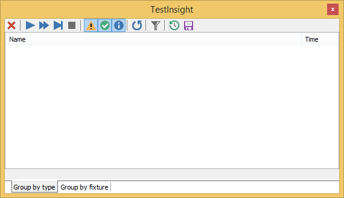
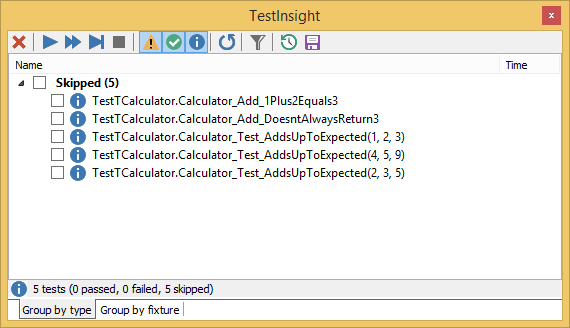
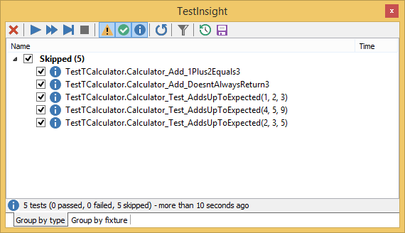
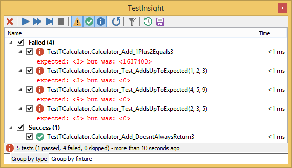
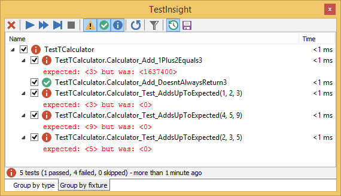
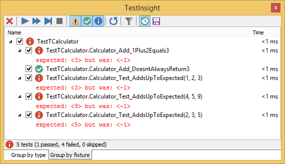
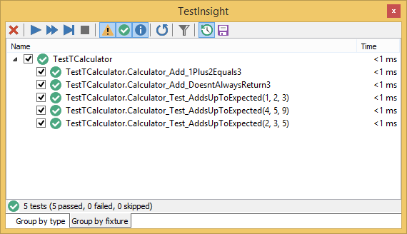

### Example of test progress

So while testing, I've made here are [some screenshots](TestInsight-Session-Example.md) to fix my CalculatorUnit tests example at

1. At first, no tests are visible.
  

2. After pressing `Run all`, the registered tests become visible:
  

3. Enabling all tests is just one click in the [Virtual TreeView](https://github.com/virtual-treeview/virtual-treeview):
  

4. After running all tests, you see which fail almost all!
   Especially watch the first failure: why does it fail that way?
  

5. Grouping by text fixture often makes the view easier when fixing logic or tests:
  

6. Always returning 3 fixes two tests:
  

7. A simple fix: simple if statement returning 2 values fixes one more test:
  

8. After refactoring the fix into the wrong algorithm, more tests fail:
  

9. The algorithm is now correct: all tests succeed!
  
