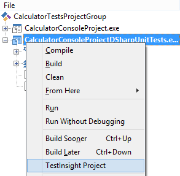
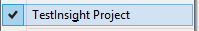
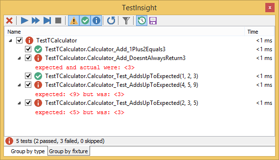
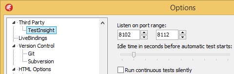

# [TestInsight](https://bitbucket.org/sglienke/testinsight/wiki/Home): automagically running your unit tests within the Delphi IDE.

[Nyborg, Denmark, 20151021](http://www.dapug.dk/2015/08/workshop-20.html)

- Examples: <https://bitbucket.org/jeroenp/besharp.net>
- Slides: <http://github.com/jpluimers/Conferences>
- Blog: <http://wiert.me>

      Unit testing is a great way of keeping new bugs from entering a changing code base. But running them and keeping an eye on them can be tedious.
      Unless you integrate the tooling in the IDE and have it run automagically when you code.

      It is part of my motto "automate everything to make your life easier".
      You will see how much faster it becomes writing tests and how easy it is to still have them run in a build system like Continua CI.

## What

TestInsight is a unit testing IDE Plugin for Delphi version XE and up.

It integrates the Unit Test process into the Delphi IDE

- no more need to run the Unit Tests externally: instant resut feedback in the IDE
- run tests from the code editor and navigate to the failing code from the results overview
- continuously runs your tests bringing test driven development in Delphi to the next level!
- still allows to debug your code (both test code and the code under test)

## Getting started

- [Download](https://bitbucket.org/sglienke/testinsight/wiki/Home): the file
    - For Delphi XE-XE7: http://files.dsharp.org/TestInsight/1.0.0.0/TestInsightSetup.exe
    - For Delphi XE8: http://files.dsharp.org/TestInsight/1.1.0.0/TestInsightXE8Setup.exe
    - There is no Delphi 10 Seattle version yet (will be in 1.1.2)

- Install:
    1. Quit all your Delphi instances
    2. Run the installer

- License: not needed; freeware.
- [Docs](https://bitbucket.org/sglienke/testinsight/wiki/Home) and [FAQ](https://bitbucket.org/sglienke/testinsight/wiki/FAQ): we will see most of them in the session.

## Why

Running unit tests automagically saves a lot of time and frustration.

For debugging, using the test-runner in DUnit/DUnit2/DUnitX is nice, but for getting an almost instant feedback IDE integration works much better. Even better: TestInsight still allows debugging.

This makes it a lot easier to follow the [test-driven development](https://en.wikipedia.org/wiki/Test-driven_development#Test-driven_development_cycle) mantra (the cycle "[red/green/refactor](https://en.wikipedia.org/wiki/Test-driven_development#Development_style)") and other [TDD best practices](https://en.wikipedia.org/wiki/Test-driven_development#Best_practices).

So it saves both time and improves your quality.

## How

TestInsight consists of these parts:

- a communications path between the unit testing frameworks and the IDE for starting/stopping tests and reporting back the results
- is a smart wrapper around the [DelphiAST](https://github.com/RomanYankovsky/DelphiAST) parser to map line numbers to methods and back
- IDE wizard and reporting screens

It parses about any Delphi language construct you can imagine. If it doesn't, report a bug (see below how).

## Example

### Viewing the TestInsight window

1. Go to the menu `View`.
2. Choose `TestInsight Explorer`.

### Preparing your project to use TestInsight

1. Enable the `TESTINSIGHT` compiler directive defined in the project:
    1. In the project manager
    2. Right click your project
    3. Choose `Testinsight Project`

[](Project-Manager--Context--Testinsight-Project.png)

TestInsight is smart enough to recognized if `TESTINSIGHT` is deinfed in a project, in which case it will show the menu entry as: [](Project-Manager--Context--Testinsight-Project--Checked.png)

2. Use the correct TestInsight framework wrapper in your project.
   The example below use `TestInsight.DUnit`, but TestInsight also supports `TestInsight.DUnit2` and `TestInsight.DUnitX`

3. Call the method `RunRegisteredTests` from your project.

Example:

```#!delphi

program CalculatorConsoleProjectDSharpUnitTests;

{$IFDEF CONSOLE_TESTRUNNER} // without it, the GUI testrunner will be used
  {$APPTYPE CONSOLE}
{$ENDIF}

uses
  DUnitTestRunner,
{$IFDEF TESTINSIGHT}
  TestInsight.DUnit,
{$ENDIF TESTINSIGHT}
  DSharpCalculatorTestUnit in 'DSharpCalculatorTestUnit.pas',
  CalculatorUnit in 'CalculatorUnit.pas';

{$R *.RES}

begin
  RunRegisteredTests;
end.
```

### Usage

The TestInsight window looks like this when some tests are enabled and ran on idle timer:



The top row has buttons, of which below I made a table describing them from left to right:


| Keyboard Shortcut | Style  | Action                 | Meaning                                                                             |
|-------------------|--------|------------------------|-------------------------------------------------------------------------------------|
|                   | Button | Clear                  | Clear results                                                                       |
|                   | Button | Run all                | Run all test                                                                        |
| Shift+Alt+F9      | Button | Run selected           | Run selected tests                                                                  |
| Alt+F9            | Button | Run test at cursor     | Run test at the position of the cursor in the code editor                           |
|                   | Button | Terminate running test | Terminate the currently running test process                                        |
|                   | Toggle | Show warnings          | Show tests that reported a warning in the previous test run                         |
|                   | Toggle | Show passed            | Show tests that passed in the previous test run                                     |
|                   | Toggle | Show skipped           | Show tests that were skipped in the previous test runs                              |
|                   | Toggle | Show progress          | Show the progress of a running test project by sending each test result immediately |
|                   | Toggle | Filter test results    | Filter test results                                                                 |
|                   | Toggle | Run tests continuously | Run tests continuously when idle                                                    |
|                   | Toggle | Run test after saving  | Run tests when the project is saved                                                 |

Note:

> Report progress is long running tests. It makes FixInsight send each tests result immediately to Delphi. When disabled, FixInsight sends all results when all tests have finished running.

The `run tests continuously` option is great, and confiurable. TestInsight settings are like regular Delphi settings under the menu entry `Tools` -> `Options`: browse to `Third Party` -> `Test Insight` to view the [options frame](TestInsight-Settings.png).

[](TestInsight-Settings.png)

The default Idle time is 2 seconds.

### Example of test progress

So while testing, I've made here are [some screenshots](TestInsight-Session-Example.md) to fix my [CalculatorUnit tests example](https://bitbucket.org/jeroenp/besharp.net/src/tip/Native/Delphi/Tests/UnitTests/CalculatorTests).

## Supported Unit Test frameworks and Delphi versions

Supported Unit Test frameworks:

- DUnit
- DUnit2
- DUnitX

Supported Delphi versions:

- Delphi XE
- Delphi XE2
- Delphi XE3
- Delphi XE4
- Delphi XE5
- Delphi XE6
- Delphi XE7
- Delphi XE8 as of TestInsight version 1.1
- Delphi 10 Seattle as of TestInsight version 1.1.2.0

## Reporting issues

Like any software, TestInsight can have issues.  
Read the [FAQ](https://bitbucket.org/sglienke/testinsight/wiki/FAQ) first before reporting an issue.

If it is a real issue, report it at http://bitbucket.org/sglienke/testinsight/issues

## Time to play

1. Run it on your own unit tests base.
2. Make a few failing tests succeed.
3. Volunteer to show them to the rest of the people.
