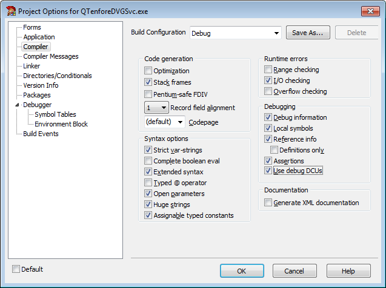
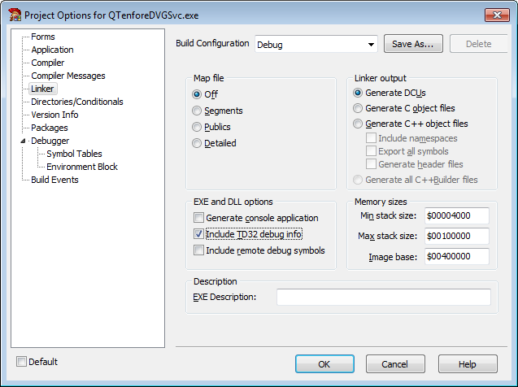
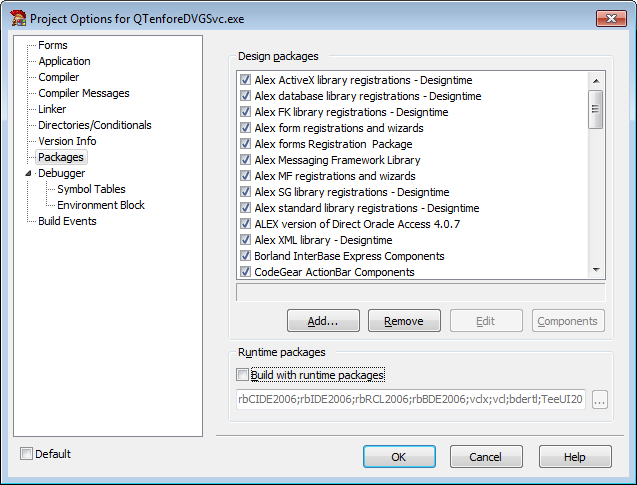
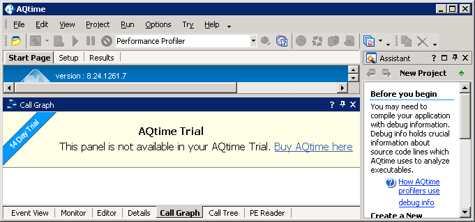
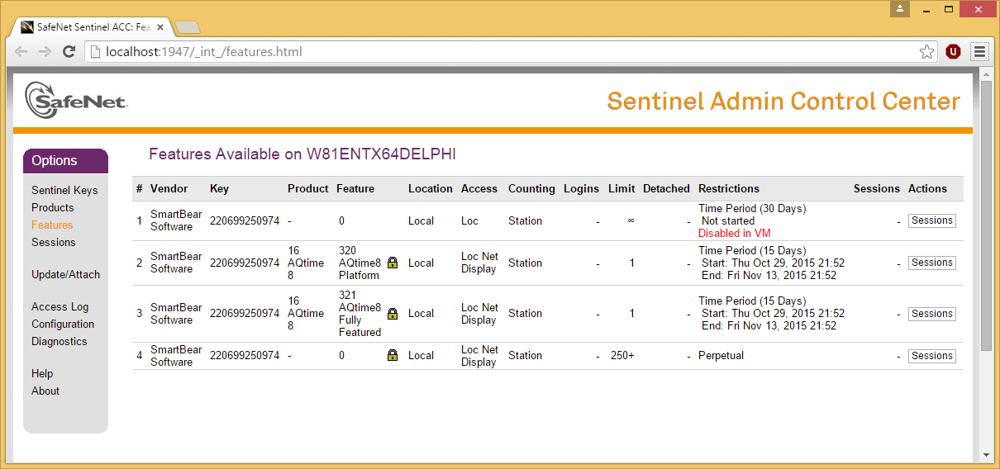
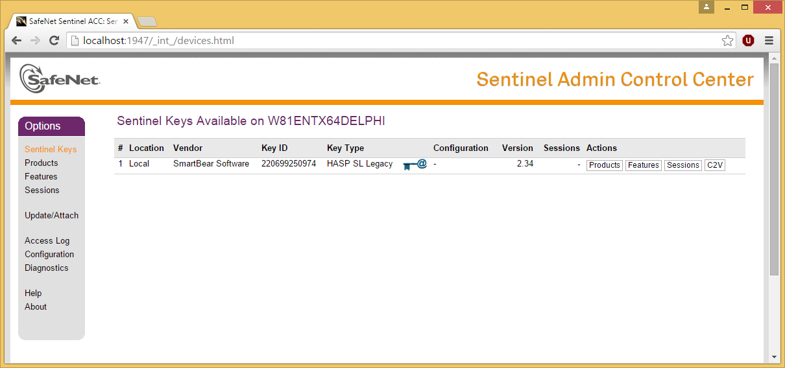
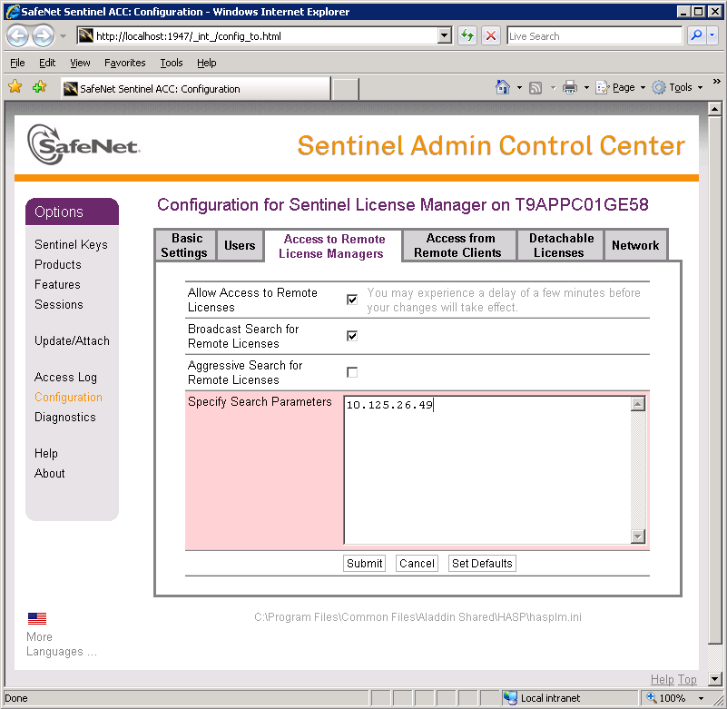
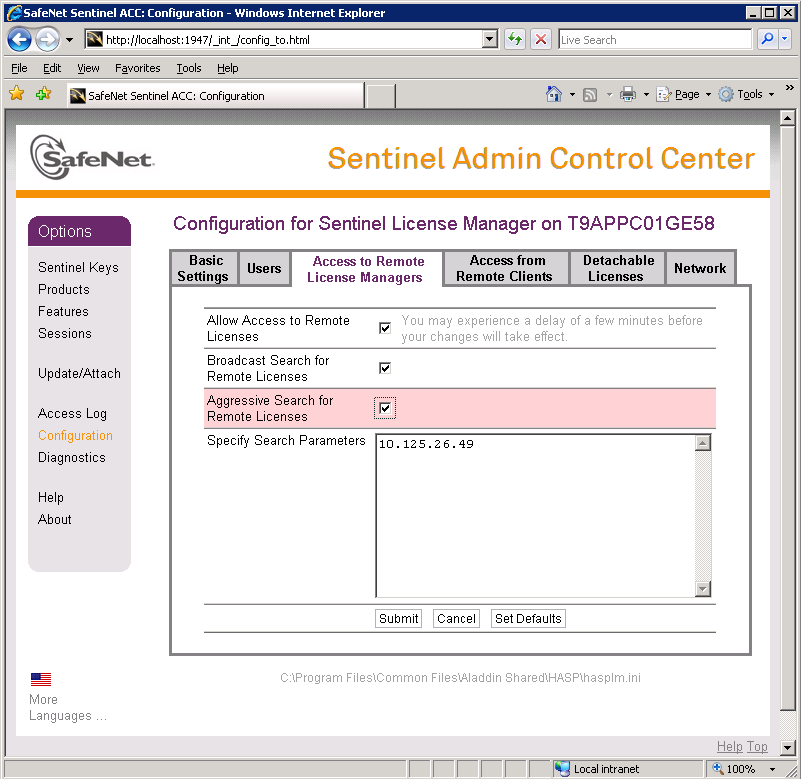
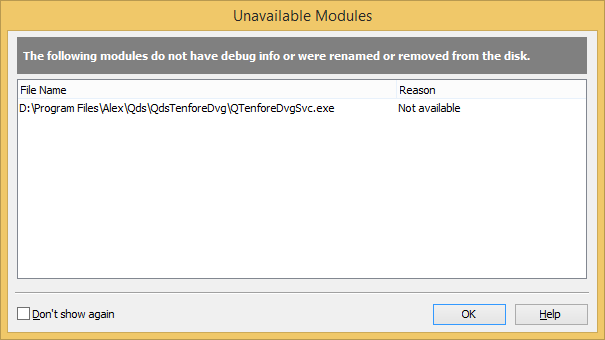
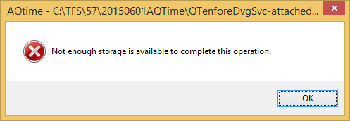

# [AQTime](http://smartbear.com/product/aqtime-pro/overview/): High Performance Delphi Apps.

[Köln, Germany, 20151103](http://web.archive.org/web/20151101153952/http://entwickler-konferenz.de/2015/de/sessions/high-performance-delphi-apps)

- Examples: <https://bitbucket.org/jeroenp/besharp.net>
- Slides: <http://github.com/jpluimers/Conferences>
- Blog: <http://wiert.me>

    This session demonstrates how a high performance stock quote processing system got improved both in capacity (it can process > 20-thousand quotes per second) and concurrency. You will see how performance measurements were done, what ways to drill through CPU and memory performance problems and multi-threading waiting issues. All of these led to some new design decisions, and confirmed an earlier multi-threading decision to work properly. The performance was increased in a big way by for instance carefully balancing choose of algorithms, moving around locks to have less locking and knowing which Delphi language features can improve or decrease performance.

## Before thinking about using tools like AQTime:

Tools like these have a large overhead, so with your prorgam using all the avaialble CPUs, you will notify artefacts. Keep 1-2 CPU cores available for AQTime to minimize the without/with AQTime situation (so they can be better compared).

The tools work "close to the metal" which means they require or work best with:

- Physical hardware (VMs only work partially) because of CPU features used
- Physical drives (subst and network drives are out) because of Windows Kernel being used
- Administrator access because Windows API calls require that

If you're in a locked-down environment (like many corporate ones), be sure to reserve time to arrange for all this before you start.

## Getting started

Only one AQTime installation can run a time; License server is often localhost, but can also be external machine. Sometimes an external machine is wiser: less chance of breaking it and transferring licenses can be tricky.

Actual measurement:

1. Performance Profiler
2. Run -> Attach to Process
3. Thread Model = “Win32 Threads”.
4. Actve Counter = “User+Kernel Time” (this should work better than “Elapsed Time”).
5. Enabled: “Profile <Root> routine”.
6. Disabled: “Disable inlining”.
7. Disabled: “Profile .NET runtime”.
8. Disabled: “Don’t show this dialog again when profiling starts”.

Notes:

- Even if you name threads, AQTime will not show them. This does not work when a thread is attached to a debugger at a later stage.
- Starting the service from within AQTime as a service won’t work at all for some services: the service process does not recognise the effort of AQTime to run it as a service.
  You get an error log like this:

        "The service process could not connect to the service controller" debugger

- SpeedStep warning; even if you disable this at the BIOS level, some machines still have it active. Not sure why, we just ignored the warning:

        ---------------------------
        AQtime
        ---------------------------
        Your processor supports the SpeedStep technology. We recommend that you disable the dynamic CPU frequency mode, because the timing results may be inaccurate if this mode is active. Continue profiling?
        ---------------------------
        Help   No   Yes   
        ---------------------------

## AQTime Profiling of a Delphi written Service

Within AQTime:
1. Create a new project
2. Open the executable
3. Ensure the mode is set to "Normal" (not "Service"!)
4. Select a profiler (in this case Coverage)
5. Run -> Attach to Process
6. Check "System Processes" checkbox so the services show up
7. Click the "Get Results" button (camera icon) to get the results while the service is still running.
8. AQTime cannot get the results upon program termination, as the service keeps running in the background.
9. The "Stop Profiling" button (red circle with cross line) will kill the service (I don't like that as restarting the service takes lots of time).

## Preparation: compiler/linker settings

(Screenshots for Delphi 2007, other Delphi versions have slightly different screenshots, but the same settings)

Always compile with debug info. For Delphi executables, ensure you have your debug information setup as follows: http://support.smartbear.com/viewarticle/43104/

Compiling:
1. Enable "Stack frames".
2. Enable "Debug information".
3. Enable "Local symbols".
4. Enable "Use debug .dcus".

Linking:
1. Enable "Debug information".
2. Enable "Place debug information in separate TDS file" (this stores the TD32 symbol information in a separate TDS file).

Packages:
1. Disable "Link with run-time packages".

## AQTime running notes

Running isn’t painless: sometime the licensing software gets confused and keeps the license locked.
Since the default licensing consists of 1 floating license, AQTime then goes into “evaluation mode” or worse: refuses to start at all:

    ---------------------------
    AQtime – No Activated License Found
    ---------------------------
    All the product instances allowed by your license key are already in use (running).
    No more instances can be launched at the moment.
    Please contact your system administrator for a list of computers where the product is currently running.
    If you have already closed some running instances on other PCs, click "Try Again".
    ---------------------------
    Try Again   Purchase   Exit   Help   
    ---------------------------

You can reset the license on your license machine, for instance when all of a sudden you see this in AQTime:

These links help:
 http://localhost:1947/_int_/features.html

 http://localhost:1947/_int_/devices.html
 

Despite the licensing issues, AQTime is a great tool.

One of the nice things on the license is that it floats for 1 machine at a time, but not for one AQTime instance. So on one machine you can run multiple AQTime instances at the same time (very convenient for comparisons).

## AQTime Installation notes

Downloads:

- http://downloads.smartbear.com/AQtimeDemo.exe - after entering the licence, it becomes a full fledged version
- http://downloads.smartbear.com/SmartBearLicenseManager.exe - install/remove licenses from a license server

Sometimes running the installer from Windows explorer fails. I've seen this happen on Windows 2003 Server systems (those should be gone by now, but you know how life goes):

    ---------------------------
    E:\tmp\AQTime-SmartBear\AQtime824.exe
    ---------------------------
    Windows cannot access the specified device, path, or file.  You may not have the appropriate permissions to access the item.
    ---------------------------
    OK   
    ---------------------------

But running it from the command-line is fine:

    E:\tmp\AQTime-SmartBear>AQtime824.exe

On Windows 7 (likely any UAC enabled Windows version: Windows Vista and up, and Windows Server 2007 and up), you need to run it As Administrator.

## Licensing notes

The license server is accsessible on port 1947. Best is to use an IP address (in my examples: `10.125.26.49`);

If these fail:

    http://10.125.26.49:1947/_int_/config.html
    telnet 10.125.26.49 1947

then port 1947 needs to be opened for both TCP and UDP on both the Windows firewall and any firewalls between your testing and licenseing machine. I've seen this happen in corporate networks.

If the port is not open, you will get this message:

    ---------------------------
    AQtime – No Activated License Found
    ---------------------------
    Unable to find an activated license.

    If you have a Trial or a Node-Locked license, please click "Activate".
    If you have a Floating User license activated on your network, click "Try Again".
    ---------------------------
    Activate   Try Again   Exit   Help   
    ---------------------------

After that you need to fix the connection between the machine on which AQtime runs (the client) and the AQtime license manager runs (the server), as upon clicking “Try Again” you will get this message (note the **Troubleshoot** button):

    ---------------------------
    AQtime – No Activated License Found
    ---------------------------
    Unable to find an activated license.

    * Make sure that your computer is connected to the network
    * Make sure the License Manager PC is available on your network.
    * Make sure that the license is activated on it.
    If needed, contact your system administrator.
    ---------------------------
    Troubleshoot   OK   Help   
    ---------------------------

First ensure that on both machines the license manager service actually runs:

| Information  | Contents                                  |
| ------------ | ----------------------------------------- |
| Executable   | `C:\WINDOWS\system32\hasplms.exe  -run`   |
| Service name | `hasplms.exe`                             |
| Display name | Sentinel LDK License Manager              |
| Description  | Manages licenses secured by Sentinel LDK. |

## when you still experience Licensing issues:

On the local machine (the one that runs AQTime):

1. Start either of these:
    - C:\Program Files\SmartBear\AQtime 8\Help\AQtime8.chm
    - C:\Program Files (x86)\SmartBear\AQtime 8\Help\AQtime8.chm
2. In “Search” find “Message - Unable to find an activated license.”
3. Go to http://localhost:1947/_int_/config_to.html
4. Ensure the IP address of the license server (`10.125.26.49`) is in “Specify Search Parameters”:


5. Then press “Submit”
6. When that fails too, enable “Aggressive Search for Remote Licenses”:


7. Then press “Submit”
8. When all else fails:
    The licensing troubleshooter is at http://support.smartbear.com/troubleshooter/?prod=Licensing

## Licensing Troubleshooter quotes:

Examlle Q&A steps.

1. Do you have an activated license for the product in your network?
Yes:
2. Are you running the product on a computer where the license is activated?
No:

3. What type of product license have you activated in your network?
Floating User License:

4. Can you browse the remote License Manager's settings?
No: see the above incident; get it resolved first.
Yes:

If all else fails, the final page allows you to submit screenshots to SmartBear. They are usually quickly (withing a workday) to respond and get you going.

This is what you need:

- Client PC (the one where AQTime runs)

    Please make screenshots of the following licensing service configuration pages on the computer where you are running the product and send them to us:
    http://localhost:1947/_int_/devices.html
    http://localhost:1947/_int_/products.html
    http://localhost:1947/_int_/features.html
    http://localhost:1947/_int_/config.html
    http://localhost:1947/_int_/config_to.html
    http://localhost:1947/_int_/diag.html

- Server PC (the one where the license manager runs)

    Please make screenshots of the following licensing service configuration pages on the License Manager PC (where the license is activated) and send them to us:
    http://localhost:1947/_int_/devices.html
    http://localhost:1947/_int_/products.html
    http://localhost:1947/_int_/features.html
    http://localhost:1947/_int_/config.html
    http://localhost:1947/_int_/config_from.html
    http://localhost:1947/_int_/config_users.html
    http://localhost:1947/_int_/diag.html

## Sampling Profiler versus Counting Profiler

Sampling Profiler gets a sample every # nanoseconds of where your app is executing. The results are summarised so you get statitics analysis.

Performance Profiler measures actual performance of your application using counters, most of which are CPU based. There,

- Elapsed Time measures total time of functions including time spent waiting for other threads
- User Time measures total CPU time spent in the function itself.
- User+Kernel Time measures total CPU time spent in the function itself calls to Windows Kernel functions.

Not all counters are available on all Intel processors.  
Virtual Machines have far less counters available then physical machines.

More back-ground information:

- Sampling Profiler: http://support.smartbear.com/viewarticle/54581/
- Performance Profiler: https://support.smartbear.com/viewarticle/43055/
- Counters: http://support.smartbear.com/viewarticle/43055/

## Moving your AQTime Results to another PC

The AQTime Results consists of these files:

- *.aqt: summary
- subdirectories with GUID files: details
- the original executables at the exact location where they were on a
    In my case that was on `D:\Program Files\...` so I had to create a new small physical D: drive in my VM to support this.
- the original source code

### A drive subst does ****not**** work!

Normally when applications require a different drive, I make "fake" a D: drive `subst D: C:\...\D` where `C:\..\D` has the content of the drive.

Batch file I usually create for this insite that `D` directory (it allows me to move the directory around):

    setlocal
      set Directory=%~dp0
      echo Directory=%Directory%
    :: strip trailing backslash
      set Directory=%Directory:~0,-1%
      echo %Directory%
      subst D: %Directory%
    endlocal

Well, since AQTime is so close to the hardware, you need a real drive, not a fake drive. The error message is **not** intuitive:

### After copying, inspecting results give you errors

I'm not sure what causes this:

[Not enough storage is available to complete this operation](https://www.google.com/search?q=aqtime+%22not+enough+storage+is+available+to+complete+this+operation%22)

To work around this is to make screenshots and electronic notes of your analysis on the machine where you did the profiling.

Things that I think might cause it:

- Windows 8.1 versus Windows Server 2003
- AQTime version

It's on my research list to solve.

## Some of the CPU related optimizations done

### `const` Parameters

Especially worth in code that is executed a lot. In our case: in the integer list.

    type
      TIntegerList = class(TPersistent)
      // ...
      protected
        function Get(const Index: Integer): Integer; virtual;
        function GetObject(const Index: Integer): TObject; virtual;
        procedure Put(const Index, Value: Integer); virtual;
        procedure PutObject(const Index: Integer; const AObject: TObject); virtual;
      public
        property Items[const Index: Integer]: Integer read Get write Put; default;
        property Objects[const Index: Integer]: TObject read GetObject write PutObject;
      end;

    implementation

    // ...

    function TIntegerList.Get(const Index: Integer): Integer;
    begin
      if (Index < 0) or (Index >= FCount) then
        Error(SIndexOutOfRange);
      Result := FList^[Index].FInteger;
    end;

    function TIntegerList.GetObject(const Index: Integer): TObject;
    begin
      if (Index < 0) or (Index >= FCount) then
        Error(SIndexOutOfRange);
      Result := FList^[Index].FObject;
    end;

    procedure TIntegerList.Put(const Index, Value: Integer);
    begin
      if Sorted then
        Error(SInsertNotAllowed);
      if (Index < 0) or (Index >= FCount) then
        Error(SIndexOutOfRange);
      Changing;
      FList^[Index].FInteger := Value;
      Changed;
    end;

    procedure TIntegerList.PutObject(const Index: Integer; const AObject: TObject);
    begin
      if (Index < 0) or (Index >= FCount) then
        Error(SIndexOutOfRange);
      Changing;
      FList^[Index].FObject := AObject;
      Changed;
    end;

    end.

### Put invariants outside the loop

/// OLD

    procedure TOptimiser.GetMessages(AOutgoings: TOutgoingMessages; AMaxMessages: Integer; var AStatistics: TStatistics);
    var
      I: Integer;
      LOutgoing: TOutgoing;
    begin
      Self.BeginRead; // read lock
      try
        for I := 0 to Self.Count - 1 do
        begin
          LOutgoing := TOutgoing(Self.Objects[FIndex]);
          LOutgoing.GetMessages(AOutgoings, AStatistics);

          Inc(FIndex);
          if (FIndex >= Self.Count) then
          begin
            FIndex := 0;
            Break;
          end;

          if AOutgoings.Count >= AMaxMessages then
            Break;
        end;
      finally
        Self.EndRead;
      end;
    end;

/// NEW

    procedure TOptimiser.GetMessages(const AOutgoings: TOutgoingMessages; const AMaxMessages: Integer; var AStatistics:
      TStatistics);
    var
      I: Integer;
      LCount: Integer;
      LOutgoing: TOutgoing;
    begin
      Self.BeginRead; // read lock
      try
        LCount := Self.Count;
        for I := 0 to LCount - 1 do // TODO -cjwp: Ask co-workerif we can do a downto here.
        begin
          LOutgoing := TOutgoing(Self.Objects[FIndex]);
          LOutgoing.GetMessages(AOutgoings, AStatistics);

          Inc(FIndex);
          if (FIndex >= LCount) then
          begin
            FIndex := 0;
            Break;
          end;

          if AOutgoings.Count >= AMaxMessages then
            Break;
        end;
      finally
        Self.EndRead;
      end;
    end;

### `to` versus `downto`

    /// OLD

    procedure TOptimizer.Clear;
    var
      LOutgoing: TOutgoing;
      I: Integer;
    begin
      for I := 0 to Self.Count - 1 do // <--- to
      begin
        LOutgoing := Self.Outgoings[I];
        Dispose(LOutgoing);
      end;
      inherited Clear;
    end;

    /// NEW

    procedure TOptimizer.Clear;
    var
      LOutgoing: TOutgoing;
      I: Integer;
    begin
      for I := Self.Count - 1 downto 0 do // <<--- downto
      begin
        LOutgoing := Self.Outgoings[I];
        Dispose(LOutgoing);
      end;
      inherited Clear;
    end;
